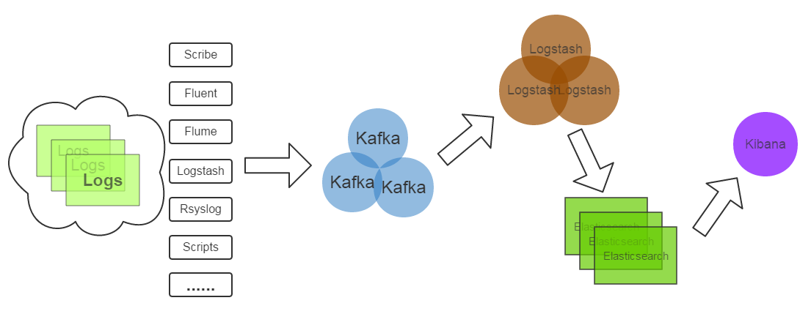
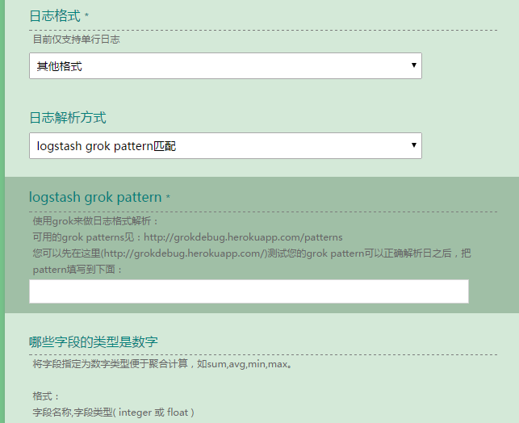

# Better ELK, 新浪实时日志分析服务进化

我从2014年初入职新浪后就开始接触实时日志分析相关的技术，主要是ELK(Elasticsearch, Logstash, Kibana)，当时是学习+ELK优化，接一些日志，小打小闹。从2015年起，我们正式得把实时日志分析分析作为服务提供给公司的其他部门。今天要给大家分享的是在服务化的道路上，我们的想法，方案和疑问。

---

## 服务介绍

随着实时分析技术的发展及成本的降低，用户已经不仅仅满足于离线分析。目前我们服务的用户包括微博，微盘，云存储，弹性计算平台等十多个部门的多个产品的日志搜索分析业务，每天处理约32亿条(2TB)日志。

## 技术架构

简单介绍一下服务的技术架构：

这是一个再常见不过的架构了：
（1）Kafka：接收用户日志的消息队列
（2）Logstash：做日志解析，统一成json输出给Elasticsearch
（3）Elasticsearch：实时日志分析服务的核心技术，一个schemaless，实时的数据存储服务，通过index组织数据，兼具强大的搜索和统计功能。
（4）Kibana：基于Elasticsearch的数据可视化组件，超强的数据可视化能力是众多公司选择ELK stack的重要原因。

## 努力提供更好的服务

我这次分享的重点不是这种架构的优劣或为什么选择这样的架构，而是在如此的架构上如何更好地传递实时日志分析的价值。为用户做好服务也不是修改几个配置文件，调优几个程序运行参数就能搞定的。为了提供更好的服务，我们在下面三个方向做了努力：

### 一、提升服务质量
我们首先做了Elasticsearch优化，Hardware Level由于我们当时拿到机器没有选择余地，只开启了超线程；System Level的优化如关闭swap,调整max open files等；App Level的优化如Java运行环境版本的选择，ES_HEAP_SIZE的设置，修改bulk index的queue size等，另外还设置了默认的index template, 目的是更改默认的shard,replica数并将string改为not_analyzed, 开启doc_values，以应对elasticsearch进程OOM。详细的优化内容见[Elasticsearch Optimization Checklist](https://github.com/garyelephant/blog/blob/master/elasticsearch_optimization_checklist.md)

Logstash优化：

随着用户数据的不断增长，index管理也成了大问题，我们需要基于大量不同的用户配置定期的create, optimize, close, delete, snapshot不同的index，在某个服务器上手工配置crontab已是不可能，而且cron是单点。于是我们开发了一个独立的Elasticsearch Index管理系统，负责以上任务的调度及执行。这个管理系统背后使用的技术是Celery，一个用Python开发的任务队列及执行系统，提供了类似crontab的定时任务配置语法，并且实现了分布式，可用性更高的架构。

最近的服务升级，我们为Elasticsearch安装了Hdfs Snapshot插件，可以定期将index 备份到Hdfs，这个功能目前主要用于备份Kibana的配置index，用以恢复用户查看或配置可视化界面时的错误操作。

监控报警方面，System Level的监控报警（如硬盘满，损坏，服务器宕机）直接使用了在新浪内部提供了多年服务的sinawatch；App Level（如Elasticsearch JVM Heap Usage过高，Kibana能否正常访问，Kafka topic的consumer offset lag）, 我们开发了对应的监控报警脚本。User Level(如日志解析失败数量)，主要通过elasticsearch python client执行`query`去统计或搜索。常见的报警是Logstash-filter-grok，logstash-filter-json解析日志失败会输出的json中添加_grokparserfailure,_jsonparsefailure,我们执行query判断解析错误的量。

要说明的是，Marvel是Elasticsearch很好的监控工具和插件，但是它们是商业软件，我们没有采用。Marvel是基于Kibana做的，里面对一些重要指标（如index bulk reject number）的展示很有价值。

### 二、增强易用性
增强服务的易用性就是给用户更好的用户体验，减少用户的抱怨。ELK性能优化是一方面，但它是远远不够的，我们遇到的实际情况是，用户在其他方面抱怨更多，如下：

（1）用户最先抱怨的是IP解析成地区、ISP信息一点都不准，完全没有参考意义
如对于CDN这种服务，我们解析用户IP不准，定位问题边缘节点错误，问题没法查，这是帮倒忙。原因：Logstash默认自带的IP库是国外maxmind公司的免费版本，中国的信息尤其不准。解决方案：使用我浪较新较全的IP库生成能适配maxmind geoip2 api的二进制格式IP库(maxmindDB)，再开发logstash-filter-geoip2来解析IP。实测不仅IP解析准确率与公司IP库相同了，解析速度也提高了。

（2）然后我们与用户都发现日志接入流程复杂，沟通困难。
人做不到机器那样分毫不差，有啥说啥。接入用户日志的时候，例如常常因为用户对日志格式表达的不全面，模棱两可，导致日志解析失败，服务对接人多次重写配置。从用户提需求到用户可以看到数据可视化效果或搜到日志，需要几个小时到几天。一来二去，用户和我们都烦了，只能求变。为此，我们正在逐步实现用户数据接入的自动化，减少接入时间和沟通成本这个过程需要3个关键：A.用户配置日志格式的界面，尽可能简洁简单；B.根据用户配置自动生成logstash config, index管理需要的配置；C.自动部署配置（logstash config等），打通日志流。

后来我们做了一个简单的用来协商日志格式的界面：

目前我们已完成了A的一部分：用户日志格式配置界面；B的全部：开发了自动生成logstash conf的 python api；C即将开始，并且考虑使用docker技术为我们提供一些便利。

（3）部分数据可视化需求得不到满足，Kibana配置难度大
我们起初采用官方Kibana v3, 用户提出的类似SQL中的多个group by，画百分比，求指定区间占比等常见需求无法满足。之后通过三斗大神(微博@argv)定制版的[Kibana 3](https://github.com/chenryn/kibana-authorization)满足了一些用户需求。Kibana 4诞生后，代码几乎是对Kibana3的重写，做了大幅改进，通过`Elasticsearch Aggregation`的强大数据统计功能及灵活的配置从Kibana 3解放出来。近期我们将迁移到Kibana 4。
 

### 三、提供新功能
我们为Elasticsearch安装了国内medcl大神开发的ik中文分词插件[elasticsearch-analysis-ik](https://github.com/medcl/elasticsearch-analysis-ik)。之前被分词为”中“和”国“的中国，现在终于可以被当做一个完整的词汇，否则搜索”中国“，“美国”也会出现。微盘的一些离线搜索需求使用了我们的服务，也用到了中文分词，Elasticsearch的搜索天赋满足了他们的需求，减少了他们的痛苦。

## 我们经历过的坑和坎儿：

（1）elasticsearch 进程JVM Heap High Usage( >90% )
很长一段时间，我们都在应对JVM Heap High Usage,他带了的问题是Old GC次数多，时间长，es节点频繁退出集群，整个集群几乎停止响应。现在我们的主要策略是开启doc_values；限制query执行时占用的JVM Heap size；analyzed string只允许做query, 不允许facets或者aggs；定期close 用户不需要的index。

（2） Elasticsearch Query DSL, Facets, Aggs学习困惑
有人为此开发了使用SQL执行ES Query的插件，一定程度上减轻了进入门槛。我们给出的学习他们的建议是观察Kibana的Request Body或试用Marvel的Senese插件，它有自动完成Query，Facets, Aggs的功能。另外最常用的query是`query string query`,最常用的aggs是`Terms`,`Date Histogram`，可以应付大部分需求。

（3）logstash不工作
非官方的问题插件，及使用logstash-filter-ruby时未考虑到的异常等，导致Logstash运行时工作线程(worker thread)异常退出，Logstash僵死。我们的建议是尽可能不要在config中使用logstash-filter-ruby，尽量使用官方插件。不过我们也遇到过复杂的日志，写过250行+的config，用尽了ruby filter。当前未发现Logstash有好的成熟的监控方案，Logstash的内部状态也获取不到。我们目前通过间接的监控Kafka topic consumer是否落后或elasticsearch indexing rate来检验logstash的工作情况。

（4）Kibana没有用户的概念，不同用户的数据无法隔离
多个用户共享的Kibana Dashboard, 误操作或误删时常影响其他用户，保存的dashboard太多，找到特定的dashboard很困难。官方到目前为止，未在这方面做过改进。有很多非官方的改进，我们也曾经用过三斗大神定制的Kibana3,也对Kibana index做了snapshot储存到Hdfs里面。

（5）与用户沟通成本高
与我们的用户协商日志格式，数据可视化配置时，由于人的不确定性容易造成多次来回确定和修改，效率低下。我们毕竟是提供日志分析服务的，不给用户做日志运维，所以近期也在探索通过日志接入自动化、推荐用户提供给我们json格式数据，定期组织用户的Kibana培训来减少沟通成本。

## 未来努力方向：
（1）日志接入全自动化：即点即用
（2）服务容器化：利用docker
（3）完整的用户服务web系统
而不是如RT工单系统似的功能之间割裂，内部功能逻辑（新增，修改，删除）割裂。信息不全，无法联动。
（4）用户数据层面的报警。
（5）服务性能优化：query时间过长的优化(日志中的慢日志)
（6）数据安全/用户隔离

---

Q & A:

**问：logstash连es出现timeout的情况有没?如何解决的?**

答：我们常见的是ES Jvm Heap Usage比较高的时候会timeout,如果是服务内存小换大内存。另外不要对analyzed的string做aggs,facets ,开启doc_values。

**问：关于日志中异常报警的，有哪些方式？关键字过滤？**

答：对于日志解析失败的情况，logstash 常见的是_grokparsefailuer,和_jsonparsefailure，数据写入es后，执行query查询这两个关键词的数量即可。对于报警方案，watch是官方刚出的，其实比它早的实现方案，如Yelp的elastalert。

**问：大数据分析平台（基于hdfs）跟kibana的展现会有很大区别吗？或者说最大的区别会在哪些方面？**

答：你说的区别，我理解是hadoop与elasticsearch的区别，一个是离线分析，以job为单位，一个是实时搜索和统计，以query为单位。这里有三个关键词：实时，搜索，统计。hadoop是离线的，es是实时的；es本质上是一个搜引擎，可以用来做全文检索等工作，hadoop显然于此无关。统计是hadoop与es都能做的，我不了解hadoop有没有像Kibana这样的数据可视化组件。

**问：你们的ES集群数据节点和查询节点做了分离吗？logstash是直接把数据写入查询节点还是数据节点？另外你们直接用的node模式还是transport模式呢？**

答：（1）还没有做分离。（2）我们还在用http protocol模式

> Written with [StackEdit](https://stackedit.io/).
