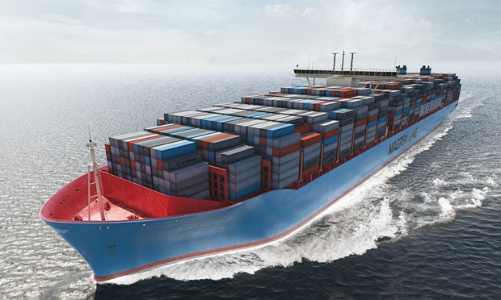
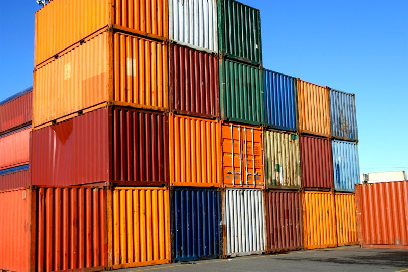
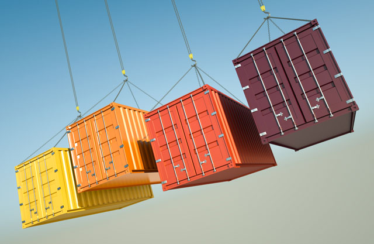

# 为什么容器技术将主宰世界

---

由于本文篇幅较长（我竟然写了7千多字），为了帮助你快速理解，我先列出核心思想：

*   先讲一个集装箱改变全球运输业的生动故事，

*   再拿容器技术与集装箱做联系与对比，说明笔者是如何通过集装箱参悟了容器技术的发展命脉 —— Docker实现了应用发布和运行的集装箱化。

*   说说容器技术，尤其是Docker的诱人之处，

*   预测容器技术的未来发展。

---
正文：

请允许我先做一个大胆的预测：容器将统治世界。本文不讨论容器技术细节，而是从更高的格局：容器对互联网的变革，它的经济成本和效益上娓娓道来。

## 集装箱何以彻底颠覆了全球运输业和世界经济？

在香港、上海、深圳或者荷兰的鹿特丹货运港口，停靠在码头的巨大的集装箱船和岸边堆场里叠起来的数万个金属集装箱；旁边数十米高的大型起重机臂不停地吊起这些几十吨的集装箱，在几分钟内安放到集装箱船上；几小时后巨轮拔锚启航，上面承载了数千个集装箱。如果你曾见识过此情此景，一定会赞叹现代航运的高效率和大容量，以及依托它而建立的广泛的全球贸易。

上世纪60年代以前，集装箱运输还未被认可，几乎所有的货物都是以`散件`方式运输。

以“勇士号”为例，在一次从布鲁克林到不来梅的运输中，货物装卸都是由普通的码头工人来完成的，它装载了5015英吨的货物，主要是食品、日用品、邮件、机器和车辆的零部件以及53辆车。这批货物的数量达到了惊人的194582件，而且大小和种类各不相同。

所有的货物都是码头工人一件一件放到货盘上，再把货盘降到船舱中一件一件搬下来堆好。他们装完这艘船总共用了6天时间，其中还有一天是因为罢工而浪费掉了。横跨大西洋的航行用了10天半的时间；在不来梅港，码头工人是昼夜不停地干活儿，他们卸船用了4天时间。总而言之，这次航行有一半时间都花在码头上。这船货物中的最后一批到达其最终目的地的时间，是”勇士号“停靠不来梅港之后的第33天，是它从纽约港起航后的第44天，是其中最早起运欧洲的货物从美国的来源地上路后的第95天。`95天！！！重要的事说3遍。`

运送这批货物的总成本达到了237577美元，还没有算上”勇士号“返回纽约的成本以及运输过程中暂时存放货物的支出。在这个总额当中，海上航行本身的支出仅占11.5%，而在航行起点和终点的两个码头上，货物处理的费用占到了总支出的36.8%。这比轮船公司的主管常常说的50%要低，但是，这仅仅是因为德国的“经济奇迹”还没有把码头工人的工资推上去。研究者注意到，如果不是因为德国码头工人的工资比美国的码头工人低1/5，港口成本肯定还会高出很多。研究者最后得出的结论是，要降低总的运输成本，最好的办法是降低在美国各港口接收、储运、装载离岗货物的成本。他们还进一步提出忠告说，政府和企业应该提高码头工人的劳动生产率，消除低效率的工作惯例，尽早彻底地反思整个流程。他们在研究报告中写道：“或许，补救的方法就在于找到可以避免散件处理的包装、搬运和装载货物的方法。”

为什么非要装载、卸载、转移和再装载那么多的散件货物？为什么不把货物装进大箱子里，然后就只装卸和搬运这些箱子？

运输业大量采用集装箱后，由咖啡制造商发出的一只35吨的集装箱，可以在马来西亚离开工厂，装上一艘货轮，经过16天的航行到达9000营里之外的洛杉矶。一天之后，这个集装箱被一列火车运到芝加哥，并被随机转移到了一辆开往辛辛那提的卡车上。从离开马来西亚的工厂到抵达俄亥俄州的仓库，这次11000营里的行程可能只需要花费22天的时间，其速度是每天500英里，而费用比一张单程的头等舱机票还低。另外，在这一路上，很可能没有人碰过集装箱里的东西，甚至根本没有人打开过它。同传统的货轮相比，集装箱船的装卸只需要大约1/6的时间和1/3的劳动力。

集装箱最大的成功在于其产品的标准化以及由此建立的一整套运输体系。无论货物的体积、形状差异有多大，最终都被装载进集装箱里。由于要实现标准尺寸集装箱的运输，堆场、码头、起吊、船舶、汽车乃至公路桥梁、隧道等，都必须适应它在全球范围内的应用而逐渐加以标准化，形成影响国际贸易的全球物流系统。由此带来的是系统效率大幅度提升，运输费大幅度下降，地球上任何一个地方生产的产品都可以快速而低廉地运送到有需求的地方。 

两种货运方式的对比：

| ...... | 散货运输 | 集装箱运输 |
|--------|--------|--------|
| 货物装卸时间 | 几天到一个星期，分拣、合并、装卸过程繁琐 | 几个小时 |
| 货物装卸时间占整个运输过程的比例 | \>50% | <10% |
| 所需劳动力 | 大量的码头工人 | 少数的码头工人和起重机操作员 |
| 自动化程度 | 低 | 高 |
| 安全性 | 低，装卸时常有物品损毁和盗窃 | 高，货物被隔离在封闭的集装箱内 |
| 总体运输时间 | 货物装卸时间+实际运输时间 | 在总距离和运输工具的运输速度不变的前提下，可节约一半以上的时间 |
| 成本 | 货物越多，成本越高，耗时越长 | 前期固定成本投入较高，随着集装箱规模、运货量的增加，分摊到运送每个集装箱的成本极低，总成本几乎不变 |
| 货物运价 | 高运价，货运成本占商品总成本的9%~15% | 低运价（运价降到原来的10%~20%），货运成本可忽略不计 |

## 集装箱对容器技术(Docker)的启发

这本书的英文名称是"The Box:How the shipping `container` made the world smaller and the world economy bigger"

阅读此书的过程中，我已经联想到了现今逐渐流行也备受质疑的以Docker为首的容器技术；当留意到`container`一词出现在书名中时，我已经迫不及待地把我的观点分享给你，帮助你从一个技术圈从未提及的角度来理解容器技术。

Docker近两年成了容器技术的代言，我们做一个集装箱与容器的类比：

| 集装箱 | 类比 | 容器技术(Docker) |
|------|------|------|
| 发货商 | <=> | 应用的发布者，现实中多为应用的生产方，即开发者 |
| 客户 | <=> | 使用应用的互联网用户 |
| 货物 | <=> | 构成应用的代码、组件、依赖等 |
| 集装箱 | <=> | Docker容器 |
| 装卸货 | <=> | 应用的发布、撤销 |
| 码头工人 | <=> | 实际操作应用发布过程的人，现实中多为运维人员 |
| 散件装卸、运输方式 | <=> | 应用发布过程中逐个安装部署代码、组件、依赖、配置环境等 |
| 集装箱装卸、运输方式 | <=> | 把应用运行所需的外部环境、内部代码、组件、依赖打包放进容器，应用发布以容器为单位 |
| 港口的码头、起重机、集装箱堆场 | <=> | 应用发布所需的基础设施与工具 |
| 轮船/轮船公司 | <=> | 容器运行平台，如可以运行容器的云计算平台 |

我开始怀疑，Docker公司的创始人读过此书或研究过货运业的发展历史，并从其中汲取了灵感，其公司的Logo即是大鲸鱼上拖着集装箱。Docker的创始人堪称当代互联网界的`麦克莱恩`[见注释1]。

## 为什么容器技术（Docker）如此诱人？

容器技术正在快速改变着公司和用户创建，发布，运行分布式应用的方式，在未来5年将给云计算行业带来它应有的价值，其诱人之处包括：

*	资源独立、隔离
资源隔离是云计算平台的最基本需求。Docker通过linux namespace, cgroup限制了硬件资源与软件运行环境，与宿主机上的其他应用实现了隔离，做到了互不影响。不同应用或服务以“集装箱”（container）为单位装“船”或卸“船”，“集装箱船”（运行container的宿主机或集群 ）上，数千数万个“集装箱”排列整齐，不同公司、不同种类的“货物”（运行应用所需的程序，组件，运行环境，依赖）保持独立。

*	环境的一致性
开发工程师完成应用开发后build一个docker image，基于这个image创建的container像是一个集装箱，里面打包了各种“散件货物”（运行应用所需的程序，组件，运行环境，依赖）。无论这个集装箱在哪里：开发环境、测试环境、生产环境，都可以确保集装箱里面的“货物”种类与个数完全相同，软件包不会在测试环境缺失，环境变量不会在生产环境忘记配置，开发环境与生产环境不会因为安装了不同版本的依赖导致应用运行异常。这样的一致性得益于“发货”（build docker image）时已经密封到”集装箱“中，而每一个环节都是在运输这个完整的、不需要拆分合并的”集装箱“。

*	轻量化
相比传统的虚拟化技术（VM），使用docker在cpu, memory, disk IO, network IO上的性能损耗都有同样水平甚至更优的表现。Container的快速创建、启动、销毁受到很多赞誉。

*	Build Once, Run Everywhere
这个特性着实吸引了我，“货物”（应用）在“汽车”，“火车”，“轮船”（私有云、公有云等服务）之间迁移交换时，只需要迁移符合标准规格和装卸方式的“集装箱”（docker container），削减了耗时费力的人工“装卸”（上线、下线应用），带来的是巨大的时间人力成本节约。这使未来仅有少数几个运维人员运维超大规模装载线上应用的容器集群成本可能，如同60年代后少数几个机器操作员即可在几小时内连装带卸完一艘万级集装箱船。

我相信以上4点是容器能够定义未来应用发布的几个原力，现在正值原力的觉醒。

我在日常工作中遇到的一个有趣的例子是：我所在的部门有人希望使用或为其他人提供大数据技术栈中的某些软件服务，如：Elasticsearch(ES), Kibana, Spark, Kafka, Redis, MongoDB。一些人甚至只是想做些简单的功能验证，而他们却要先花一上午甚至一天去依次完成下载软件本身、修改ulimit、设置环境变量、下载JAVA运行环境、编译某些组件、安装其他依赖包、创建目录、进行若干次容易出错的配置、经历3次以上程序启动失败。可悲的是，下次如果想在其他服务器上提供类似的服务仍要重复前面的经历，更别提把这个任务交给一个新人负责完成需要多长时间。他们就像50年前可怜的码头工人一样，四肢发达，头脑简单，重复着旧式散货装卸模式，抱怨着活多钱少。我们现在正着手用Docker做一个类似Google Cloud Engine一键创建服务(one click)的`Setup ELK (ES + Logstash + Kibana) in One Click`。

## 容器技术是整个互联网的协同创新和原有技术的组合创新
	
正如集装箱对全球运输业及经济的变革不应仅仅归因于集装箱本身而是全社会系统协同创新一样，Docker也将是全系统的变革和原有技术的组合创新，除了拥有运行容器的基础技术工具，还需要构建整个生态系统。如 "Build, Ship, and Run
Any App, Anywhere"需要依赖应用所有的宿主在基础架构上搭建好docker container的运行环境才可以；而要实现现在容器行业大力宣扬的”大规模应用弹性伸缩“，如果没有大规模的容器和资源管理方案（如Mesos, Kubernetes）是绝不可能实现的。Docker公司在这方面还是比较有远见的，自己开发或收购了不少产品布局整个生态，如Docker hub, Docker swarm,  Docker compose, Tutum。

实际的货运中，发货商只关注货物从出发到到达客户手中的总运价和时间，他们希望减少总成本和时间，运输公司负责并且能够处理好公路铁路航海运输中的一切细节。没有发货人会去关注运输的路线、顺序以及集装箱轮船停靠在哪个港口。目前提供容器服务的产品还远未达到真正帮助应用发布者节省时间和成本的目的，享受容器优势的同时，应用发布者总是不得不亲自处理各种细节甚至亲自实现其中缺失的功能，开发者在Docker及周边产品的源码中发现了很多坑，由此导致的额外成本埋没了容器服务潜在的巨大价值。随着容器技术及其生态系统的发展，相信以上问题会逐渐得到改善，Docker版本的迭代速度一直很快。

## 容器技术（Docker）的必然发展趋势

我们在这里预测一下容器技术接下来的发展：
> 容器技术本身及生态系统的发展

*	容器是一项伟大的变革，但它还不能在短时间内产生巨大效益

我们中国人何不尽早加入容器行列，与美国佬一起完善的容器生态系统呢，还那么钟爱Copy to China?

*	自动化

随着云计算和容器的普及，互联网行业自动化程度将进一步提高，运维人员由劳动密集型逐渐转向技术知识密集型。

*	容器技术标准

容器相关的技术标准的诞生将促进整个大系统的各方更好的协调和兼容。

*	云计算平台的支持

现有云计算平台要么尽快支持容器技术，要么被新的支持容器的云计算平台超越。中国香港、上海、深圳、青岛、天津在上世纪60~80年代抓住了集装箱发展的机遇，成为全球供应链上的主要枢纽港，2014年仍处在全球10个最大吞吐量集装箱港之列。

*	使用容器的习惯逐渐形成

培养应用发布者使用容器发布应用的习惯是非技术问题，也最重要需要时间去沉淀。全球运输业花了近15年培养出了发货商使用集装箱的习惯，在互联网行业不需要这么慢。

*	行业规模

Mesos, Kubernetes等容器管理方案将助力 “巴拿马级”，“马六甲级”[见注释2]的容器“轮船”。Mesos, Kubernetes等成熟通用的集群管理方案将为你做好大规模分布式容器的启停、调度、编排、高可用。与现有的大部分互联网服务类似，容器依赖于规模，云计算平台服务的客户越多，运行的容器规模越大，构建整套容器运行体系的固定成本就被分摊得越薄，客户使用云计算服务的资费就能降下来。

*	应用在云计算平台间的无缝迁移

未来的应用在不同的云计算平台（支持容器）间迁移成本更低。如同集装箱在汽车、火车、集装箱船之间的无缝迁移。

在未来世界，云计算不止是互联网的公共基础服务，也是被互联网渗透的所有行业的公共基础服务，公有云也好，私有云也罢，几乎所有的信息服务都将在云上。从集装箱诞生到运输业广泛采用集装箱，大宗货物运输成本普遍减少50%以上，耗费了约60年。我相信在互联网领域，容器的普及都用不了6年，希望在这个互联网基础服务里掘金的企业，请跑步入场！

---

## 注释
1.	麦克莱恩是历史上第一个用纯集装箱船运输装在集装箱里的大宗货物的企业家，他极大推动了集装箱运输方式在运输业(公路、铁路、航海)的发展和普及。

2.	巴拿马级，马六甲级的轮船指的是巴拿马运河、马六甲海峡允许通过的最大尺寸的轮船，意指集装箱船体量大，运载能力强。如《集装箱改变世界》一书中提到“马六甲级集装箱船的长度将达到1320英尺，宽地达到190英尺，它的运载能力将是18000只标准箱。”

----

## References

1.	《集装箱改变世界》
ISBN: 9787111449966 机械工业出版社 出版年: 2014-1

2. 百度百科“集装箱”词条
http://baike.baidu.com/view/50438.htm

3.	Ranking of Container Ports of the World
http://www.mardep.gov.hk/en/publication/pdf/portstat_2_y_b5.pdf

4.	The largest container ports worldwide in 2014, based on throughput
http://www.statista.com/statistics/264171/turnover-volume-of-the-largest-container-ports-worldwide/

5.	Competitiveness of the port of Hong Kong
http://www.legco.gov.hk/research-publications/english/1314rb01-competitiveness-of-the-port-of-hong-kong-20131121-e.pdf

6.	 Docker官方网站
https://www.docker.com/ 

7.	 Docker VP Marianna Tessel：下一步容器技术的热点 
http://dockone.io/article/750

8.	IBM Research Report:An Updated Performance Comparison of Virtual Machines and Linux Containers
http://domino.research.ibm.com/library/cyberdig.nsf/papers/0929052195DD819C85257D2300681E7B/$File/rc25482.pdf

9.	酷壳的Docker基础技术系列
http://coolshell.cn/articles/17010.html

10.	Kubernetes Official Website
http://kubernetes.io/

11.	Learn DCOS
https://mesosphere.com/

> Written with [StackEdit](https://stackedit.io/).
