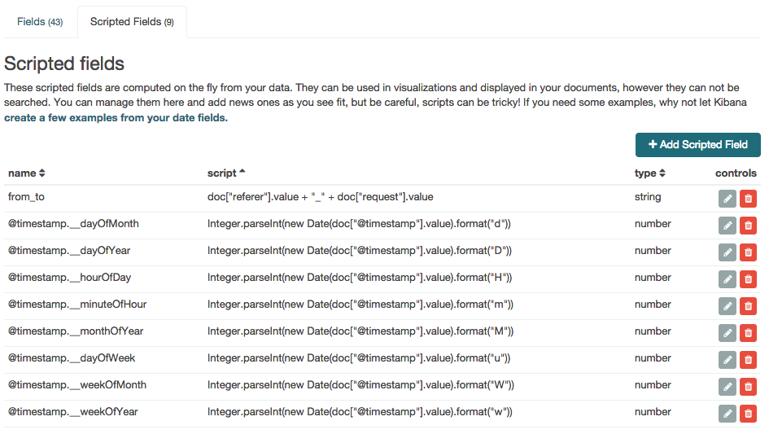
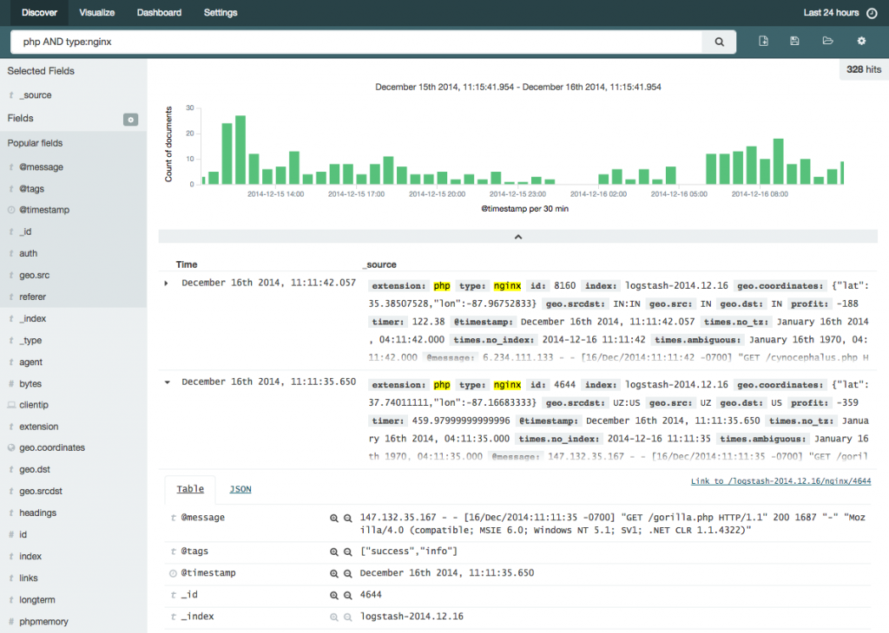
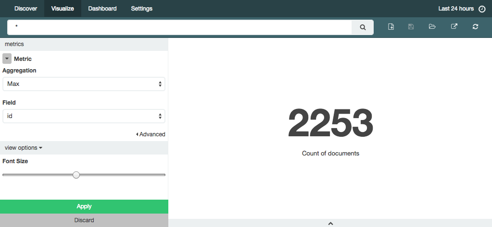

# Elasticsearch 2014年12月简报

---

## Elasticsearch Updates
*	Elasticsearch 1.4.2发布了
	一些改进和bug fix，没有大变化。
	*    改进
		*   根据磁盘剩余空间判断shard存储位置的逻辑在速度上有大幅提升，这也提升了cluster重启后的恢复速度。
		*    提升了把Snapshot镜像到shared file system的速度。
		*     减少了不必要的cluster state更新。
		*     index stats API 在有shard恢复的情况下不再阻塞。

*	Elasticsearch 1.3.7发布了
改进和bug fix，release note见:[Elasticsearch 1.3.7 released](http://www.elasticsearch.org/downloads/1-3-7)

*   Elasticsearch, Logstash, Kibana, Marvel的官方documents, tutorial现在都统一放在了这里：http://www.elasticsearch.org/guide/。以后看docs统统到这里！
这里的logstash的documents比logstash.net的更详尽，以后logstash.net的documents也会逐渐停止更新。


## Elasticsearch Ecosystem Updates
*	 Logstash 1.5.0 Beta 1发布了
1.5.0主要的变化是：

	 *    插件管理：插件与Logstash主程序分离了，使用 rubygems.org来发布插件，另外附带一个plugin命令来管理插件。所以现在Logstash与Elasitcsearch的插件管理方式相似了。

	 *    性能提升：grok filter的正则匹配做了优化，如官方测试了一下COMBINEDAPACHELOG，相比1.4.2,性能近乎提高了1倍。json的序列化与反序列化性能提升超过了1倍。

	 *     Apache Kafka：增加了对最近很火的分布式消息系统kafka input,output的支持.

	 *     安全性：elasticsearch input, filter, output插件增加了验证和传输层的加密支持。(这是为Elasticsearch.com公司的另一款即将发布的安全产品Shield做准备的)transport encryption support.

	 *     改进和bug fix:
		*    允许为event包含`metadata`,它不会被logstash output插件输出，这个新功能避免了在event上生成临时的`field`.([#1834](https://github.com/elasticsearch/logstash/issues/1834), [#LOGSTASH-1798](https://logstash.jira.com/browse/LOGSTASH-1798))
		*     Logstash默认去掉了`message.raw `。

 ```
 科普：如何安装Kafka插件
 安装kafka input插件：
 $LS_HOME/bin/plugin install logstash-input-kafka
 安装kafka output插件：
 $LS_HOME/bin/plugin install logstash-output-kafka
 或者到https://rubygems.org/中搜索logstash-input-kafka(或者logstash-output-kafka), 点"Download"下载`gem` 文件，再
  $LS_HOME/bin/plugin install your_gem_file_path
 ```

*	 Kibana 4 Beta3 发布了
	*    interactive charts and dashboards
`Dashboard` Tab上添加了`filter`，条形图，饼图上的元素都可以点击来创建`filter`，`filter`的操控性比kibana3 更好。


	*     scripted fields
用户可用脚本对若干field的值进行计算或字符串操作，并将结果输出到另外的field中。这个field是`scripted field`，可以像普通field一样在kibana中使用它。因为`scripted field`不存储在elasticsearch中，所以不能对其进行搜索。


	*     highlighting and a new format for _source
在搜索的结果数据中，关键词被高亮，显得更突出。`_source`的展现方式也更加人性化。


	*     hit links
看上图，如果要分享一条数据给其他人，可以点右侧的`Link to....`。以前只能分享整个`dashboard`的链接，现在可以分享单条数据的链接，但这个有啥用呢？我觉得倒不如能分享单个图表更有意义，像`keen.io`提供的api那样，方便把某个图表嵌入到任意页面中。

	*     metric visualization
新增了`metric`类型，就是一个图表中只有一个大大的数字。



*	NEST 1.3.0 发布了elasticsearch 的.net client, see [release note](https://github.com/elasticsearch/elasticsearch-net/releases/tag/1.3.0)

*	Marvel 1.3.0 发布了，主要更新如下：
	*    sense中加入了1.4.x新增的api自动补全提示。
	*    增加了对HTTPS的支持。
	*    monitoring ui增加了对elasticsearch 1.4.0新增的 circuit breakers的监控，以及对circuit break limit,  Query Cache, index throttling, index writerd的内存使用，version map的监控。 
	*     Sense: 增加了禁掉mappings和index名称自动完成的设置。PS：以前没有此功能时，我们的es集群有200+ index, 打开sense会假死一段时间，因为浏览器要解析很多mappings.
	*     sense 新增API举例: Cluster Reroute API, Get Field Mappings API, cluster.routing.allocation.* settings,  Scripted Metric Aggregation, simple_query_string query, Top Hits aggregation,  Percentiles Rank aggregation,  Disk Threshold Allocator settings

完整的更新列表见[marvel 1.3.0 released](http://www.elasticsearch.org/blog/marvel-1-3-0-released/)


## Amazing Slides & tutorials & videos
*	exciting logstash plugin ecosystem changes
这篇blog讲了logstash 1.5.x的插件管理方式及开发方式。
http://www.elasticsearch.org/blog/plugin-ecosystem-changes/

*	Maintaining performance in distributed systems by Elasticsearch Inc
https://speakerdeck.com/elasticsearch/maintaining-performance-in-distributed-systems

*	setting up and using Kibana 4 Beta
Kibana 4 尝鲜
http://amsterdam.luminis.eu/2014/12/01/experiment-with-the-kibana-4-beta/#more-76

*	[Video] Short and sweet: Demo of Weave to tie together Elasticsearch, Docker, and Apache Spark
https://www.youtube.com/watch?v=BSY9rnK9QBs&list=UUmIz9ew1lA3-XDy5FqY-mrA

*	Optimization of Relevance Scores in Elasticsearch 
https://www.voxxed.com/blog/2014/12/advanced-scoring-elasticsearch/

*	Logstash on Linux with Elasticsearch, Redis, and Nginx
ELK入门，很详细的DIY教程
http://www.thegeekstuff.com/2014/12/logstash-setup

*	Tuning for Elasticsearch
ES性能优化，法语的，用translate.google.com搞定吧
http://blog.ebiznext.com/2014/12/16/elasticsearch-performance-tuning/

*	Scripted Aggregations 
http://www.elasticsearch.org/videos/scripted-aggregations-london-december-meetup-2014/


## Meetups in China
*	Nothing

##References
1.	Elasticsearch 1.4.2 and 1.3.7 releasedDecember 16, 2014 http://www.elasticsearch.org/blog/elasticsearch-1-4-2-released/
2.	This Week in ElasticsearchDecember 3, 2014 http://www.elasticsearch.org/blog/2014-12-03-this-week-in-elasticsearch/
3.	This week in ElasticsearchDecember 10, 2014 http://www.elasticsearch.org/blog/2014-12-10-this-week-in-elasticsearch/
4.	This Week in ElasticsearchDecember 17, 2014 http://www.elasticsearch.org/blog/2014-12-17-this-week-in-elasticsearch/
5.	Kibana 4 Beta 3: Now more filteryDecember 16, 2014 http://www.elasticsearch.org/blog/kibana-4-beta-3-now-more-filtery/
6.	Logstash 1.5.0.Beta1 releasedDecember 11, 2014 http://www.elasticsearch.org/blog/logstash-1-5-0-beta1-released/
7.	Exciting Logstash Plugin Ecosystem ChangesDecember 12, 2014 http://www.elasticsearch.org/blog/plugin-ecosystem-changes/ 
8.	NEST and Elasticsearch.NET 1.3December 9, 2014 http://www.elasticsearch.org/blog/nest-and-elasticsearch-net-1-3/
9.	Marvel 1.3.0 releasedDecember 17, 2014 http://www.elasticsearch.org/blog/marvel-1-3-0-released/


TODO:

*	At last week’s Elasticsearch meetup in Chicago, Dan Crumb (of our lovely meetup host, Vodori) gave a demonstration using Docker and Fig to easily run Elasticsearch in containers on a laptop. He’s now [shared the code and the how-to](https://github.com/vodori/es-fig-docker/) behind his demonstration, and [video](http://vimeo.com/113497975) is available from the meetup, as well.

*	elasticsearch videos http://www.elasticsearch.org/videos/

> Written with [StackEdit](https://stackedit.io/).