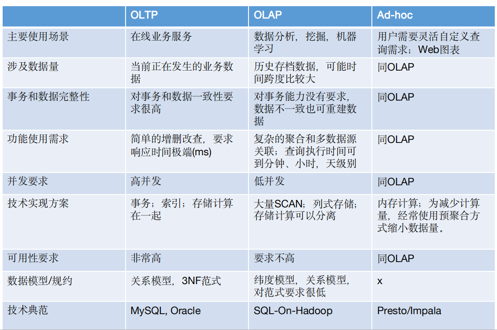
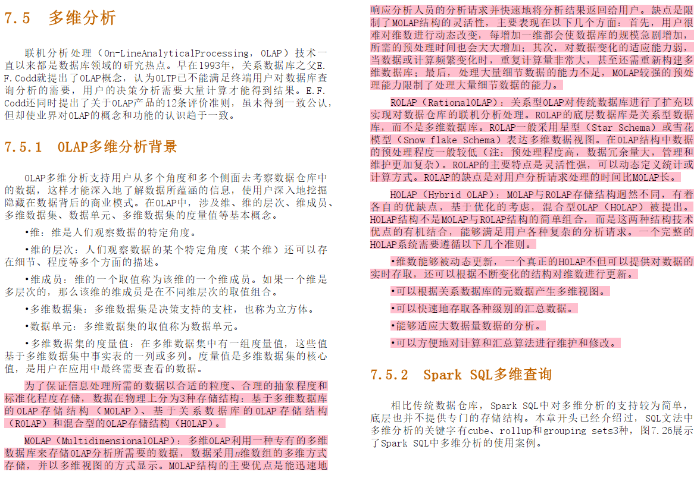

# 大数据的基础理论

## CAP

## 数据仓库基础理论

数据仓库，数据湖，数据集市，数据模型：kimbo, nimbo

数据库模型：星型模型，雪花模型。

事实表，维度表。

ACID

---

## Olap, Oltp, Adhoc

### 1. Olap vs Oltp vs Adhoc

### 2. Olap 细分

对MOlap, ROlap, HOlap 的区分。

来自《Spark SQL　内核剖析》
---

## mpp vs mapreduce vs Spark DAG

http://www.jianshu.com/p/5191daa1a454

http://www.cnblogs.com/yepei/p/6292440.html

## Paxos / 2PC / 3PC

## MVCC

---

## Q&A

1. 结构化数据 vs 半结构化数据 vs 无结构数据

结构化数据：有固定结构，如mysql表中的数据。
半结构化数据：有结构，但无固定结构，如：JSON
无结构化数据：没有结构的数据，如图像

2. 关系型数据库
二维表，关系型数据库存储的是结构化数据。

3. 什么是 NoSQL

key-value: Redis, Document: Mongodb, Graph Database: Neo4j

4. 数据模型

kimbo，nimbo

5. 关系型数据库 vs OLTP, OLAP

关系型数据库与OLTP，OLAP不可比较，不在相同维度。OLAP，OLTP指的是应用场景，关系型数据更适合OLTP场景。

6. OLAP vs OLTP

不同的应用场景。

7. 数据仓库 vs 数据集市 vs 数据湖

数据仓库：结构化数据。

---

## References

http://datawarehouse4u.info/OLTP-vs-OLAP.html

https://academy.vertabelo.com/blog/oltp-vs-olap-whats-difference/
