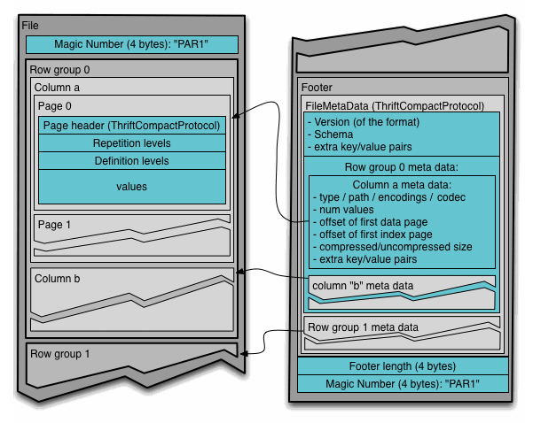
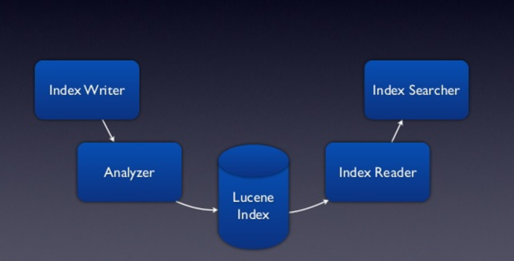
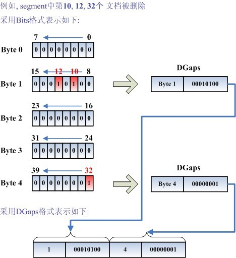

# Parquet vs Carbondata vs Lucene vs Arrow vs mmdb

---

## 列示存储的优势：
1. 减少IO：列可以按需加载
2. 减少存储：更紧凑的编码和压缩
3. 只读取需要的列，支持向量运算，能够获取更好的扫描性能。

---

## Parquet核心知识

1. 列和行的存储方式

Row group:

	1. 写入数据的时候最大的缓存单元
	2. Map/Reduce任务的最小并发单元
	3. 一般大小在50MB – 1GB间

Column chunk:

	1. 存储当前Row group 内某一列的数据
	2. 最小的IO并发单元

Page:
	1. 压缩、读取的最小数据单元
	2. 获得单条数据的时候最小的读取数据单元（索引页生效的时候）
	3. 大小一般在8KB – 1MB 之间，越大压缩效率越高

Footer:

	1. 数据Schema 信息
	2. 每个Row group 的元信息：偏移量、大小
	3. 每个Column chunk 的元信息：各个列的编码格式、首页偏移量、首索引页偏移量、个数、大小等等

2. 元数据的结构
3. 读、写的方式
4. 如何支持嵌套结构
Parquet 嵌套格式:

	1. 思想来源于Google Dremel 的论文（Nested record shredding/assembly），Schema 描述基于protobuf格式
	2. 每一条数据单元，都由(Repetition Level, Definition Level, Value) 三元组构成
	3. 数据记录依赖Schema 的最大深度进行进行解析

关键点：schema扁平化（叶子节点个数为column个数），Nested record shredding/assembly。

Repetition Level, Definition Level, Value学习笔记：

（1）level：0，1，2，不嵌套level就是0，嵌套1层，level就是1
（2）在一个column chunk中，new record的Repetition Level = 0，否则Repetition Level = 值所在层级的上一级
（3）Definition Level = 从值开始向上遍历，非Null的level

5. 每列的编码方式

Bit packing:

• Small integers encoded in the minimum bits required
• Useful for repetition level, definition levels and dictionary keys

Run Length Encoding:

• Used in combination with bit packing
• Cheap compression
• Works well for definition level of sparse columns.

Dictionary encoding:

• Useful for columns with few ( < 50,000 ) distinct values
• When applicable, compresses better and faster than heavyweight algorithms (gzip, lzo, snappy)

6. Parquet文件优化：
6.1 谓词下推(Predicate PushDown)

在数据库之类的查询系统中最常用的优化手段就是谓词下推了，通过将一些过滤条件尽可能的在最底层执行可以减少每一层交互的数据量，从而提升性能，例如”select count(1) from A Join B on A.id = B.id where A.a > 10 and B.b < 100″SQL查询中，在处理Join操作之前需要首先对A和B执行TableScan操作，然后再进行Join，再执行过滤，最后计算聚合函数返回，但是如果把过滤条件A.a > 10和B.b < 100分别移到A表的TableScan和B表的TableScan的时候执行，可以大大降低Join操作的输入数据。

无论是行式存储还是列式存储，都可以在将过滤条件在读取一条记录之后执行以判断该记录是否需要返回给调用者，在Parquet做了更进一步的优化，优化的方法时对每一个Row Group的每一个Column Chunk在存储的时候都计算对应的统计信息，包括该Column Chunk的最大值、最小值和空值个数。通过这些统计值和该列的过滤条件可以判断该Row Group是否需要扫描。另外Parquet未来还会增加诸如Bloom Filter和Index等优化数据，更加有效的完成谓词下推。

7. 索引

Parquet支持row group level的min/max索引，支持谓词下推并直接根据meta信息过滤row group。在row level上，parquet亦支持谓词下推，但是需要先读取并解析命中的dimension列，然后决定是否过滤此行数据。

## Carbondata

详见[Carbondata File Format](https://github.com/HuaweiBigData/carbondata/wiki/CarbonData-File-Structure-and-Format)

CarbonData file format is a columnar store in HDFS, it has many features that a modern columnar format has, such as splittable, compression schema ,complex data type etc, and CarbonData has following unique features:

* Stores data along with index: it can significantly accelerate query performance and reduces the I/O scans and CPU resources, where there are filters in the query. CarbonData index consists of multiple level of indices, a processing framework can leverage this index to reduce the task it needs to schedule and process, and it can also do skip scan in more finer grain unit (called blocklet) in task side scanning instead of scanning the whole file.

* Operable encoded data :Through supporting efficient compression and global encoding schemes, can query on compressed/encoded data, the data can be converted just before returning the results to the users, which is "late materialized".

* Supports for various use cases with one single Data format : like interactive OLAP-style query, Sequential Access (big scan), Random Access (narrow scan).

1. 文件格式：

我们最感兴趣的索引相关内容，在文件格式中没有体现。

https://github.com/apache/carbondata/blob/master/docs/file-structure-of-carbondata.md

2. 索引：

[Spark Summit 上关于索引的详细介绍](https://www.slideshare.net/SparkSummit/apache-carbondata-an-indexed-columnar-file-format-for-interactive-query-with-spark-sql-spark-summit-east-talk-by-jacky-li-and-jihong-ma)

column chunk 可以以倒排索引的方式存储数据，索引即数据，数据即索引。

Carbondata支持File level和blocklet level上的min/max索引，以及row level上的invert index索引。在carbondata默认的spark sql引擎上，不同level的索引起作用的方式不同：
File level索引用于在driver进行过滤，减少executor的负载
blocklet level索引在executor的task中起作用
Row level索引（invert index）在executor端读取数据时过滤数据。    
相比parquet和orc，carbondata的过滤层次更丰富，粒度也更细，能更有效的过滤数据。
Carbondata采用MDK（multi-dimension keys）对多列进行排序，同时跨多个文件范围内进行排序，以此来提高索引的效率。
MDK计算原理如图3所示，根据create table时声明Column的顺序，先按照首列排序，然后在首列相同值的范围内排序第二列，以此类推。在获得MDK排序后，再计算各个维度的反向索引，并压缩存储。

## Lucene

1. 倒排索引原理

Lucene 使用SkipList而不是Btree实现inverted index.

https://stackoverflow.com/questions/2602253/how-does-lucene-index-documents

Term Dictionary, Document Frequency, Posting List:

http://alexbenedetti.blogspot.hk/2015/07/exploring-solr-internals-lucene.html

2. Lucene Index 读写流程

3. 文件格式

Lucene的索引结构是有层次结构的，主要分以下几个层次：

* 索引(Index)：

在Lucene中一个索引是放在一个文件夹中的。
如上图，同一文件夹中的所有的文件构成一个Lucene索引。

* 段(Segment)：

一个索引可以包含多个段，段与段之间是独立的，添加新文档可以生成新的段，不同的段可以合并。
如上图，具有相同前缀文件的属同一个段，图中共两个段 "_0" 和 "_1"。
segments.gen和segments_5是段的元数据文件，也即它们保存了段的属性信息。

* 文档(Document)：

文档是我们建索引的基本单位，不同的文档是保存在不同的段中的，一个段可以包含多篇文档。
新添加的文档是单独保存在一个新生成的段中，随着段的合并，不同的文档合并到同一个段中。

* 域(Field)：

一篇文档包含不同类型的信息，可以分开索引，比如标题，时间，正文，作者等，都可以保存在不同的域里。
不同域的索引方式可以不同，在真正解析域的存储的时候，我们会详细解读。

* 词(Term)：

词是索引的最小单位，是经过词法分析和语言处理后的字符串。

4. Lucene Document Delete

.del文件用于标记segment中被删除的文档，且此文件只有当segment中存在被删除的文档时才会出现。
在.del文件中，用一个bit标记一个文件，计数时既计bit的数量(BitCount)又记所占用的Byte数量(ByteCount).标记被删除文件的方法有两种，
一种是用一个bit对应一个文件，当某bit置1时表示对应的文件被删除，涉及到的bit全部被存储，这种方法被称为Bits format(Bits 格式)；
另一种方法是对第一种方法表示的结果采用另一种方式存储，在删除文件数量较少的情况下可以减少存储空间，它只存储非0的Byte(字节)以及该Byte号(是第几个Byte)，
不存储为0的Byte，这种方法被称为DGaps format(DGaps 格式)，具体机构示意图如下所示。

http://www.cnblogs.com/zhouqing/archive/2012/11/25/2776366.html

5. 列式存储与聚合：Doc values/ Facets

---

## Q&A:

1. parquet 如何存储嵌套结构？

2. parquet 中每个row group中所有row的顺序是如何决定的？

3. parquet 用到的 Nested record shredding/assembly • Algorithm borrowed from Google Dremel's column IO 是啥？

4. parquet Repetition levels, Definition levels和values是什么？

5. Parquet, Carbondata, Lucene 如何实现更新和删除？

Carbondata, Lucene 实现Delete的方式与类似，Parquet不直接支持Delete.

---

References:

https://blog.twitter.com/engineering/en_us/a/2013/dremel-made-simple-with-parquet.html
http://www.infoq.com/cn/articles/in-depth-analysis-of-parquet-column-storage-format
http://www.tuicool.com/articles/u6bMnuZ
http://lvheyang.com/wp-content/uploads/2016/02/%E5%88%97%E5%BC%8F%E5%AD%98%E5%82%A8%E4%B8%8EParquet%E6%96%87%E4%BB%B6%E6%A0%BC%E5%BC%8F%E5%88%86%E4%BA%AB-2.pdf
http://www.jianshu.com/p/47b39ae336d5
http://cdn.oreillystatic.com/en/assets/1/event/100/Parquet_%20An%20Open%20Columnar%20Storage%20for%20Hadoop%20Presentation%201.pdf
https://github.com/apache/parquet-format
https://www.slideshare.net/julienledem/parquet-hadoop-summit-2013
https://research.google.com/pubs/pub36632.html
https://github.com/apache/carbondata
http://carbondata.apache.org/
https://github.com/QiangCai/carbondata_guide
https://github.com/zzboy/lucene
https://github.com/apache/arrow
https://www.quora.com/How-will-Googles-Dremel-change-future-Hadoop-releases

https://mp.weixin.qq.com/s/XFjUdVvbD-RMWAvJID0zmA
http://carbondata.apache.org/file-structure-of-carbondata.html
https://www.slideshare.net/SparkSummit/apache-carbondata-an-indexed-columnar-file-format-for-interactive-query-with-spark-sql-spark-summit-east-talk-by-jacky-li-and-jihong-ma

https://stackoverflow.com/questions/256511/skip-list-vs-binary-tree/28270537#28270537
https://www.slideshare.net/Kozovaya/solr-for-provectus
https://stackoverflow.com/questions/2602253/how-does-lucene-index-documents
http://alexbenedetti.blogspot.hk/2015/07/exploring-solr-internals-lucene.html
https://www.slideshare.net/gamgoster/architecture-and-implementation-of-apache-lucene-13105167
https://berlinbuzzwords.de/15/session/algorithms-and-data-structures-power-lucene-and-elasticsearch
http://www.cnblogs.com/forfuture1978
http://www.cnblogs.com/forfuture1978/archive/2009/12/14/1623597.html