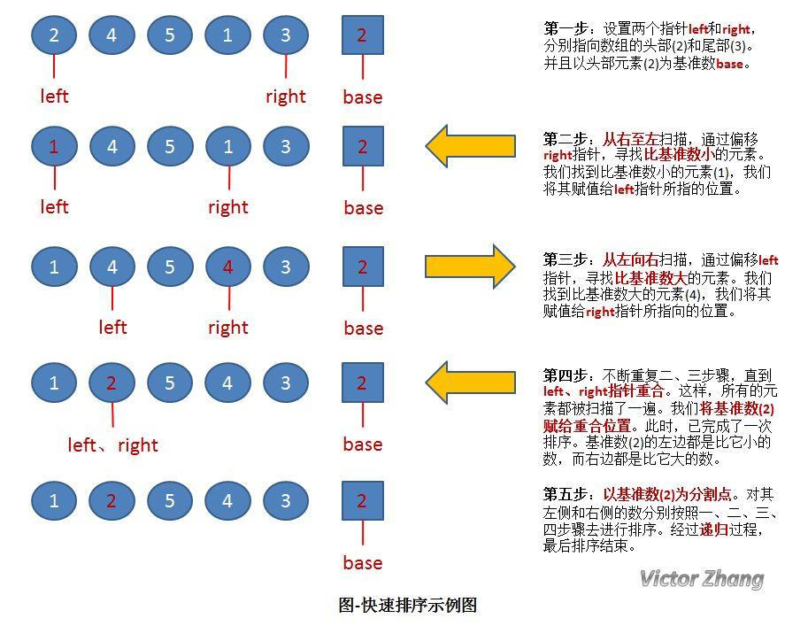
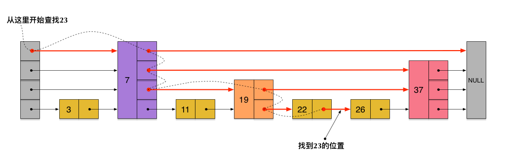
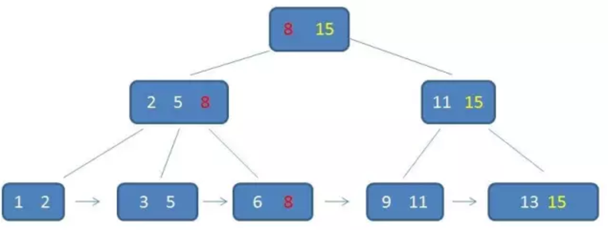

# 数据结构与算法

## 排序算法

1. 插入排序：

简单插入排序算法原理：从整个待排序列中选出一个元素插入到已经有序的子序列中去，得到一个有序的、元素加一的子序列，直到整个序列的待插入元素为0，则整个序列全部有序。

在实际的算法中，我们经常选择序列的第一个元素作为有序序列（因为一个元素肯定是有序的），我们逐渐将后面的元素插入到前面的有序序列中，直到整个序列有序。

2. 冒泡排序：

原理：比较两个相邻的元素，将值大的元素交换至右端。

思路：依次比较相邻的两个数，将小数放在前面，大数放在后面。即在第一趟：首先比较第1个和第2个数，将小数放前，大数放后。然后比较第2个数和第3个数，将小数放前，大数放后，如此继续，直至比较最后两个数，将小数放前，大数放后。重复第一趟步骤，直至全部排序完成。

第一趟比较完成后，最后一个数一定是数组中最大的一个数，所以第二趟比较的时候最后一个数不参与比较；

第二趟比较完成后，倒数第二个数也一定是数组中第二大的数，所以第三趟比较的时候最后两个数不参与比较；

依次类推，每一趟比较次数-1；

3. 堆排序

堆是具有以下性质的完全二叉树：每个结点的值都大于或等于其左右孩子结点的值，称为大顶堆；或者每个结点的值都小于或等于其左右孩子结点的值，称为小顶堆。

堆排序的基本思想是：将待排序序列构造成一个大顶堆，此时，整个序列的最大值就是堆顶的根节点。将其与末尾元素进行交换，此时末尾就为最大值。然后将剩余n-1个元素重新构造成一个堆，这样会得到n个元素的次小值。如此反复执行，便能得到一个有序序列了。

参见: https://www.cnblogs.com/chengxiao/p/6129630.html

4. 快速排序

快速排序流程如下：


具体代码可参考：https://www.jianshu.com/p/5f38dd54b11f

5. 归并排序

归并排序（MERGE-SORT）是利用归并的思想实现的排序方法，该算法采用经典的分治（divide-and-conquer）策略（分治法将问题分(divide)成一些小的问题然后递归求解，而治(conquer)的阶段则将分的阶段得到的各答案"修补"在一起，即分而治之)。


代码参见：https://www.cnblogs.com/chengxiao/p/6194356.html


8大排序算法的实现，复杂度，稳定性。


各种排序的稳定性，时间复杂度和空间复杂度总结：


## 查找算法

顺序查找，二分查找，分块查找，散列表，利用树形结构实现查找（二分查找树，红黑树，BTree）

[二分查找的时间复杂度推导](http://www.cnblogs.com/sheeva/p/6501591.html)

## 跳跃表（SkipList）

什么是跳跃表？https://weibo.com/ttarticle/p/show?id=2309404129356560600034


跳表具有如下性质：

(1) 由很多层结构组成

(2) 每一层都是一个有序的链表

(3) 最底层(Level 1)的链表包含所有元素

(4) 如果一个元素出现在 Level i 的链表中，则它在 Level i 之下的链表也都会出现。

(5) 每个节点包含两个指针，一个指向同一链表中的下一个元素，一个指向下面一层的元素。

跳跃表的查找：



```
/* 如果存在 x, 返回 x 所在的节点， 
 * 否则返回 x 的后继节点 */  
find(x)   
{  
    p = top;  
    while (1) {  
        while (p->next->key < x)  
            p = p->next;  
        if (p->down == NULL)   
            return p->next;  
        p = p->down;  
    }  
}  
```

跳跃表的插入:

先确定该元素要占据的层数 K（采用丢硬币的方式，这完全是随机的）
然后在 Level 1 ... Level K 各个层的链表都插入元素。


跳跃表删除节点：

无论是插入，还是删除，都是先查找。删除节点的过程就是普通链表删除节点的过程。

skiplist的插入，删除、查找时间复杂度：O(logN):

SkipList是一种概率算法，非常依赖于生成的随机数。这里不能用rand() % MAX_LEVEL的简单做法，而要用满足p=1/2几何分布的随机数。

来看RandomLevel()的代码：

```
int SkipList::RandomLevel(void) {
    int level = 0;
    while(rand() % 2 && level < MAX_LEVEL - 1)
        ++level;
    return level;
}
```

这里不做太多的数学分析，只做直观解释。考虑MAX_LEVEL = 4的情形，可能的返回值为0、1、2、3，显然出现概率分别为：

P(0) = (1/2)^0 * (1/2) = 1/2
P(1) = (1/2)^1 * (1/2) = 1/4
P(2) = (1/2)^2 * (1/2) = 1/8
P(3) = 1 - P(0) - P(1) - P(2) = 1/8

假设有16个元素的话，可以预计第0层有16个元素，第1层约有16 - 8 = 8个元素，第2层约有16 - 8 - 4 = 4个元素，第3层约有16 - 8 -4 -2 = 2个元素，从底向上每层元素数量大约减少一半。

SkipList层数合适时自顶向下搜索，理想情况下每下降一层，搜索范围减小一半，达到类似二分查找的效果，效率为O(lgn)；最坏情况下也只是curr从head移动到tail，效率为O(n)。


http://kenby.iteye.com/blog/1187303

http://zhangtielei.com/posts/blog-redis-skiplist.html

FAQ:

Q1: skiplist 有几层是如何决定的？某个节点在哪一层出现是如何决定的？

A1: 插入的新节点，都会通过`投硬币`觉得其所在的最大层数；所有节点所在最大层数的最大值，即跳跃表的层数。

Q2: 跳跃表查找的起始点在哪里？

A2: 最左侧最上层的节点（有点类似二分查找树）。

Q3: Java中的相关实现？

A3: ConcurrentSkipListMap, ConcurrentSkipListSet

Q4: 跳跃表 vs 平衡树(AVL, 红黑树, 2-3树) ? 

A4: 跳表是一种随机性的数据结构，相对于平衡树来说，跳表更加的简单，能一口气实现红黑树,AVL这样的平衡树的人，还是太少了，而且内部确实复杂，调试, 用起来太麻烦。 
同样跳表还可以做到平衡树那样的查找时间，特别是在并发的场景下面，由于红黑树的插入或者删除会做rebalance这样操作，那么影响的数据就会变多，锁的粒度就变大。
但是跳表的插入或者删除操作影响的数据会很小，锁的粒度就会小，这样在大数据量的情况下，跳表的性能自然就会比红黑树要好。

https://softwareengineering.stackexchange.com/questions/287254/how-does-a-skip-list-work

Q5: 跳跃表的生产环境应用？

A5: Redis SortedSet, Lucene

Q6: 跳跃表的Java实现？


## 树的数据结构与常用算法（重点红黑树、B-Tree）

### 树的遍历：

深度优先遍历：前序，中序，后序

广度优先遍历，通过FIFO队列实现：

```
(1) 第一步先讲Root节点放入FIFO队列。

(2) 从FIFO中取出一个节点，进行遍历。

(3) 遍历到某个节点时，将其子节点加入队列，先不遍历。
```

### 二叉查找树和查找算法

### B-树和B+树

> B-树就是B树，中间的横线不是减号

B-树是一种多路平衡查找树，它的每个节点最多包含m个孩子，m被称为B树的阶。m的大小取决于磁盘页的大小。

一个m阶的B-树具有如下几个特征：

```
1.根结点至少有两个子女。

2.每个中间节点都包含k-1个元素和k个孩子，其中 m/2 <= k <= m

3.每一个叶子节点都包含k-1个元素，其中 m/2 <= k <= m

4.所有的叶子结点都位于同一层。

5.每个节点中的元素从小到大排列，节点当中k-1个元素正好是k个孩子包含的元素的值域分划。
```


B-树的插入操作：[详细流程](https://github.com/garyelephant/The-Art-Of-Programming-By-July/blob/master/ebook/zh/03.02.md#41-插入insert操作)


插入操作的要点整理：

```
(1) 插入前先确定中间节点，叶子节点的元素个数范围 ceil(m/2) -1 <= k -1 <= m -1, 不能违背。（ceil是向上取整）
(2) 插入新元素到叶子节点。 
(3) 树根至少有2个child，但是包含元素个数不受限制，可以仅有1个。
(4) 为满足所有叶子节点在同一层，`分裂`应该向上层节点分裂。向上分裂可能引起多层向上分裂。
(5) 向上分裂是把被分裂的节点中的元素分成[left] [middle] [right], middle元素只有1个，left，right的元素个数均分; middle元素顶到上一层。
```

B-树的删除操作：[详细流程](https://github.com/garyelephant/The-Art-Of-Programming-By-July/blob/master/ebook/zh/03.02.md#42删除delete操作)

删除操作的要点整理：

```
(1) 节点的元素被删除后，如果这个节点的元素个数不满足要求，则需要修复，方法是[按顺序]：
    a) 先找孩子讨要：如果此节点被删除的元素有右孩子，则此元素的值由右孩子的第一个后继元素补上。右孩子删掉对应元素。
    b) 再找兄弟讨要：如果没有右孩子（叶子节点），如果左右兄弟有多余的元素，可以通过左旋或者右旋的方式来拿到1个元素。
    c) 再找爹讨要：如果左右兄弟都没有多余的元素，则此节点连同左兄弟和夹在它们中间的父元素一起合并。
```

一个m阶的B+树具有如下几个特征：

```
1.叶子节点包含的元素个数与B-树的要求相同，每个元素不保存数据，只用来索引，所有数据都保存在叶子节点。

2.所有的叶子结点中包含了全部元素的信息，及指向含这些元素记录的指针，且叶子结点本身依关键字的大小自小而大顺序链接。

3.所有的中间节点中仅含有其子树根结点中最大（或最小）元素，不包含索引指向的数据。(中间节点有的元素，叶子节点一定有)。

```



B+树的优势：

```

1.单一节点存储更多的元素，使得查询的IO次数更少。

2.所有查询都要查找到叶子节点，查询性能稳定。

3.所有叶子节点形成有序链表，便于范围查询。

```

B+树的查找操作：

```
自顶向下，直到叶子节点上才能找到索引对应的数据。
```

B+树的插入操作：

```
记住保留3个特征：
(1) 有k个子树的中间节点包含有k个元素
(2) 所有的中间节点元素都同时存在于子节点，在子节点元素中是最大（或最小）元素。
(3) 叶子结点本身依关键字的大小自小而大顺序链接。 
```

B+树的删除操作：

```
```

[图解B+树的插入和删除(一看就懂）](https://yq.aliyun.com/articles/9280)

图解B-树的插入，删除操作：
https://blog.csdn.net/Holmofy/article/details/79830773
https://www.jianshu.com/p/cf7dba86c391

建议参考：
1. 从MySQL, MongoDB对B-Tree, B+Tree的实际应用中，研究B-Tree的原理
https://www.cnblogs.com/Leo_wl/p/8578279.html
https://www.cnblogs.com/kaleidoscope/p/9481991.html


FAQ：

Q1: B+树的实现细节是什么样的？

Q2: B-树和B+树有什么区别？

Q3: MySQL 联合索引在B+树中如何存储？

Q4: 已经有了二叉查找树，为什么还需要B-/B+树？

Q5: B-/B+树？为什么适合做数据库，文件系统的索引结构？

Q6: B-/B+树？如何实现插入，查找，删除？

由于插入删除新的数据记录会破坏B-Tree的性质，因此在插入删除时，需要对树进行一个分裂、合并、转移等操作以保持B-Tree性质。

Q7: B-/B+树的Java 实现？

Q8: 为什么B-/B+树比二分查找树，红黑树更适合做数据库/文件系统索引？为什么B+树比B-树更适合？

A8: 用B树的原因：虽然时间复杂度都是O(logN)，但是索引往往过大，不可能全部加载到内存，往往是查找索引的过程中，将索引逐步加载到内存中。
考虑到磁盘IO性能，需要尽量减少查找树的层数并利用磁盘读取局部性,预加载原理（一个b-tree节点内的所有元素存储在同一个Page中，操作系统按page加载数据），减少IO。
用B+树的原因：

(1) B+-tree的磁盘读写代价更低 B+-tree的内部结点并没有指向关键字具体信息的指针。因此其内部结点相对B 树更小。
如果把所有同一内部结点的关键字存放在同一盘块中，那么盘块所能容纳的关键字数量也越多。
一次性读入内存中的需要查找的关键字也就越多。相对来说IO读写次数也就降低了。

(2)叶子连成了链表, 便于范围查找.

Q9: Skip List vs B-/B+ Tree ?

A9: 

```
(1) Skip List 虽然无法利用局部性原理，但是如果全在内存中，像寻找下一个节点的随机访问还是很快的。

(2) Skip List 比B-/B+树占用更多空间？TODO

(3) Skip List 没有像B-/B+树那样复杂的多节点分裂、合并过程，消耗CPU更少，并发时也不需要大范围加锁（并且现在已经实现了lockfree的skip list）。
```

Q10: B-Tree/B+Tree在内存中使用没有优势，在外存中使用优势很明显的原因是？

A10:

主要原因在于我们用的都是机械硬盘，机械硬盘最慢的就是寻道，寻道之后读取数据的话，2个字节同4K个字节消耗的时间几乎没有区别。用B树可以减少树高，如果用二叉树，也许需要寻道20次，B数也许2次就够了。

不过现在的SSD硬盘，不用寻道，B树就不一定强了。另外在普通机械硬盘上，顺序读写的速度要远远高于随机读写，针对于顺序写，LSM树效率更优。

---

### LSM Tree

---

### 红黑树

---

## 哈希表：HashMap, LinkedHashMap

---

## 海量数据处理

[海量数据处理](https://github.com/garyelephant/The-Art-Of-Programming-By-July/tree/master/ebook/zh)

---

## 图的数据结构与常用算法

---

## 动态规划

漫画：什么是动态规划 https://mp.weixin.qq.com/s/TQQ7UYE5y-OEfstt6Q0mog

http://cppblog.com/menjitianya/archive/2015/10/23/212084.html

https://blog.csdn.net/u013309870/article/details/75193592

https://www.cnblogs.com/wuyuegb2312/p/3281264.html

---

## References

http://blog.csdn.net/hguisu/article/details/7776068
http://www.runoob.com/w3cnote/sort-algorithm-summary.html

http://blog.csdn.net/hguisu/article/details/7776091
http://www.cnblogs.com/maybe2030/p/4715035.html

MySQL索引背后的数据结构及算法原理: http://blog.codinglabs.org/articles/theory-of-mysql-index.html

算法的可视化：https://www.cs.usfca.edu/~galles/visualization/Algorithms.html

B-树介绍：http://blog.jobbole.com/111757/

B+树介绍：https://news.uc.cn/a_1850348189949560112/

跳跃表介绍：[skip list](https://mp.weixin.qq.com/s?__biz=MzI1MTIzMzI2MA==&mid=2650561205&idx=1&sn=3c4feb6339e00e13bdd8cc6a11eb0304&chksm=f1feec36c689652085b1b89acd6ca07316140f1c7478249e4b251c204b6cf3a5bb276b0275be&mpshare=1&scene=1&srcid=0904pLvcmy82FprCyqoITvU5&key=d2b0a23c03ba1cca0bc31a5bef3f27951e06b5b7f2aca039bcee229c1a2192c653a91b43f0d37778de79d054cf58b4e63e268a9c29e5c3e5a1d0ec7d29e85bef03616e84ce6de0f02d61525400e7e688&ascene=0&uin=MjA2MzUyNzU1&devicetype=iMac+MacBookPro12%2C1+OSX+OSX+10.12+build(16A323)&version=12020610&nettype=WIFI&fontScale=100&pass_ticket=4uLYrrD8gEYAFhX2ivqVhTdw3HNghKI9atVLuHREo50%3D)

Java实现的各种算法： https://github.com/garyelephant/java-algorithms-implementation

The Story Behind MemSQL’s Skiplist Indexes： http://blog.memsql.com/the-story-behind-memsqls-skiplist-indexes/
