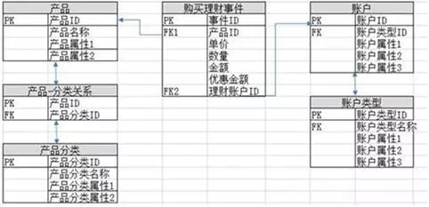
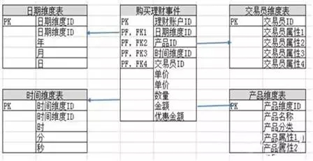
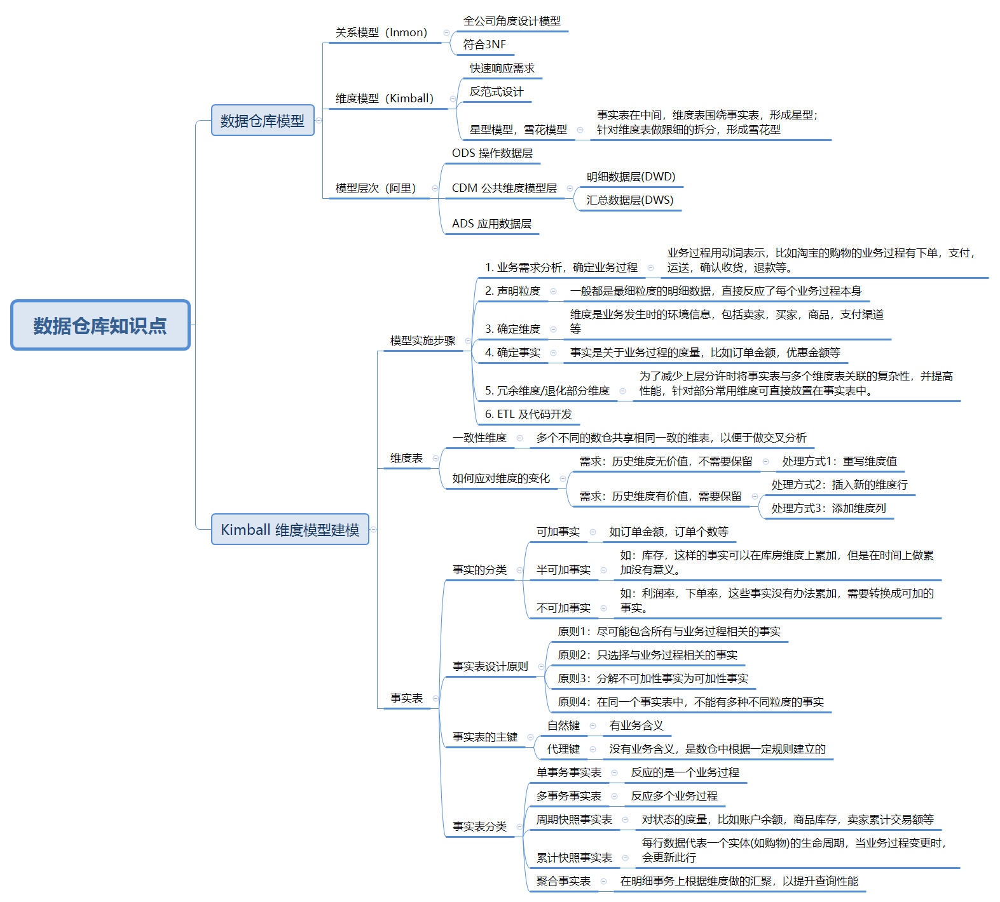

## 数据仓库理论

###  数据库理论

* ER关系

https://www.cnblogs.com/muchen/p/5265305.html

* 第一范式(1NF), 第二范式(2NF)，第三范式(3NF)

http://www.cnblogs.com/muchen/p/5272620.html

https://beginnersbook.com/2015/05/normalization-in-dbms/

https://www.guru99.com/database-normalization.html

```
# 结论： 

1NF: Only one value per column

2NF: All the non primary key columns in the table should depend on the entire primary key.

3NF: All the non primary key columns in the table should depend DIRECTLY on the entire primary key.

http://dotnetanalysis.blogspot.com/2012/01/database-normalization-sql-server.html
```


### 数据仓库理论

https://www.cnblogs.com/muchen/p/5305658.html

#### 数据建模

https://www.cnblogs.com/muchen/p/5310732.html

* Kimball(纬度模型) vs Inmon(关系模型)



上图为关系模型的建模方式，关系建模又叫ER建模，是数据仓库之父Inmon推崇的，其从全企业的高度设计一个3NF模型的方法，用实体加关系描述的数据模型描述企业业务架构，在范式理论上符合3NF，其是站在企业角度进行面向主题的抽象，而不是针对某个具体业务流程的，它更多是面向数据的整合和一致性治理，正如Inmon所希望达到的“single version of the truth”。

但是要采用此方法进行构建，也有其挑战：

* 需要全面了解企业业务和数据
* 实施周期非常长
* 对建模人员的能力要求也非常高



上图为纬度模型的建模方式。维度模型则是数据仓库领域另一位大师Ralph Kimball 所倡导的。维度建模以分析决策的需求为出发点构建模型，一般有较好的大规模复杂查询的响应性能，更直接面向业务，典型的代表是我们比较熟知的星形模型，以及在一些特殊场景下适用的雪花模型。查看上图，可以发现，中间是一张事实表（存数据），周围围绕了多个纬度表（存纬度信息），这就是星型模型。

Inmon的ER建模优点体现在规范性较好，冗余小，数据集成和数据一致性方面得到重视，适用于较为大型的企业级、战略级的规划，但缺点是需要全面了解企业业务、数据和关系，对于建模人员要求很高，实施周期非常长，成本昂贵，笔者刚进公司的时候就经历了中国移动的的ER数据仓库项目，的确不是一个新人能短时消化的。 

Kimball的维度建模相对能快速上手，快速交付，但缺点是冗余会较多，灵活性比较差，但其实现在看来也没什么，淘宝在大数据之路书中也提到“淘宝数据平台变迁的过程正好解释了二者的不同，最初，淘宝业务单一、系统简单，主要是简单的报表系统；后期数据量越来越大，系统越来越多，尝试用ER建模的数据仓库，但是在实践中发现快速变化的业务之下，构建ER模型的风险和难度都很高，现在则主要采用基于维度建模的模型方法了。”


```
微软的BI主要是基于Kimball模型的, 这个模型是反数据库三范式的, 提出了雪花模型和星型模型, 区分了事实表和维度表. Kimball还提出了一致性维度的概念. 把不同数据源的维度统一更新到一个维度上去. 就是SSAS

Inmon用的比较少, 他的数仓是符合范式(3NF)的设计, 然后用于分析的数据集市从这个normalized的数仓中派生数据, 好处是数仓是normalized的, 数据的准确性很高, 没有什么冗余的数据, 但是维护和开发工作量巨大.
常说的面向主题的数据仓库，就是Inmon的模型。

维度建模的方式: 星型模型和雪花模型

星型模型和雪花模型是区别于传统关系型数据库的三范式建模的一种建模方式, 星型模型运用广泛,效率高, 而雪花模型运用较少, 但往往会作配角存在. 为什么有了星型模型还要有雪花模型呢? 一个典型的例子就是为了支持多对多关系. 维度表和事实表见有多对多的关系. 此外当一个维度的数量级大到一定程度时, 如果用雪花模型能减少冗余数据的时候,也可以尝试使用雪花模型.

```

然而在实际生产环境中，纬度模型的应用，其实有两种情况，一种是标准的纬度模型，即事实表，纬度表分开独立，另一种是维护一个纬度和事实在一起的大宽表：

第一种情况如下：


第二种情况（大宽表）如下：


先说我们的维度模型：

* 数据冗余小（因为很多具体的信息都存在相应的维度表中了，比如用户信息就只有一份）
* 结构清晰（表结构一目了然）
* 便于做OLAP分析（数据分析用起来会很开心）
* 增加使用成本，比如查询时要关联多张表
* 数据不一致，比如用户发起购买行为的时候的数据，和我们维度表里面存放的数据不一致

再说我们这张大款表的优缺点：

* 业务直观，在做业务的时候，这种表特别方便，直接能对到业务中。
* 使用方便，写sql的时候很方便。
* 数据冗余巨大，真的很大，在几亿的用户规模下，他的订单行为会很恐怖
* 粒度僵硬，什么都写死了，这张表的可复用性太低。

另，参考：
https://www.jianshu.com/p/17baa9f96ca7
https://zhuanlan.zhihu.com/p/27426819


* 纬度模型(Kimball)：

核心概念：纬度表，事实表

模型：星形模型 vs 雪花模型

http://lxw1234.com/archives/2018/01/890.htm

https://www.infoq.cn/article/2017/10/Dimensional-Kimball-big-data-Had

http://www.databaseanswers.org/downloads/Dimensional_Modelling_by_Example.pdf

Kimball模型数据仓库建模技巧：https://zhuanlan.zhihu.com/p/26908834


结论：

```
（1）雪花模型在星形模型的基础上，将纬度表拆的更细。

```

* 数据仓库分层设计：ODS / ODS_PRODUCT / DW / DM

数据分层的数据仓库: 

第一层：ods[原始数据] --> 

第二层：ods_product[主要做一些常见的数据转换，以及Join预先关联] --->
Join预先关联指的是对于那些可以用某个或者多个字段关联在一起的数据源（必须是1:1:...:1 的关系），可以将关联字段设计为表的主键，然后用多个流式程序写入不同的数据源，即可实现了多个数据源预先关联到一张大宽表中。

举个例子: 订单和流水是1：1关联，他们的关联字段是txn_id，那么可以设计一张大宽表[txn_id, (订单的其他字段)，(流水的其他字段)]，将订单和流水做预先的关联。 

第三层：DW[基于主题的维度，指标的聚合表] ---> 

第四层：DM[将多个DW表根据产品和运营的需求来组合到一起]

* 拉链表/全量表/流量表

举一个例子，一个支付系统，里面有账户余额表，交易流水表，订单表。有交易行为时，流程是先生成订单表，用户付款后，生成流水，修改用户账户余额（一般生成流水，修改账户余额要在一个事务中，此处不是重点，就不描述了）。

流水表对应数据仓库中的概念就是流量表

账户余额表对应的就是数据仓库中的全量表，是一个维护全量数据当前状态的表。

那么拉链表是什么，如果你把账户余额的最初的数据，还有每一次账户余额的变化的binlog 都保存到另一张表里面，这个表就是拉链表，我们内部一般叫它镜像表。这个表的特点是，能够查到任意账户在任意时刻的账户余额，相当于是历史可追溯的。这个表与账户余额表的不同之处在于，账户余额表只有每个账户最新的余额状态。

账户余额表的表结构可以如下：

|accountid|currentcoin|updatetime|lastserialno|
| --- | --- | --- | --- |
| ac_123 | 30 | 2019-04-13 20:32:00 | mkrijhj2hj3h3g3 |

拉链表的表结构与账户余额表完全相同。（还有一种不同的表结构，就是拉链表里面每条记录保存了变化前，变化后的所有字段）

在财务上需求中，经常需要计算指定时刻全量用户的的期初金额，期末金额，用拉链表计算就很方便了，一个SQL搞定，追溯历史很方便，大致如下:

```
# v1
select sum(coin_1) as coin_result from
(
    select sum(coin) as coin_1
    from account
    WHERE updatetime < cast(to_timestamp('${start_time}','yyyy-MM-dd') AS BIGINT) * 1000
    AND accounttype = 'YH'
    AND currency = '00'
    AND accounttarget = '0'
union all
    select sum(t2.precoin) as coin_1 from
    (select accountid, min(updatetime) as updatetime, min(preupdatetime) as preupdatetime
    from account_snapshot
    where time_day >= cast(to_timestamp('${start_time}','yyyy-MM-dd') AS BIGINT)
    AND accounttype = 'YH'
    AND currency = '00'
    AND accounttarget = '0'
    group by accountid) as t1
    join account_snapshot as t2
    on t1.accountid = t2.accountid and t1.updatetime = t2.updatetime and t1.preupdatetime = t2.preupdatetime
) as ttx

# v2
select sum(coin_1) as coin_result from
(
    select sum(coin) as coin_1
    from account
    WHERE updatetime < cast(to_timestamp('${start_time}','yyyy-MM-dd') AS BIGINT) * 1000
    AND accounttype = 'YH'
    AND currency = '00'
    AND accounttarget = '0'
union all
    -- 与 v1 的效果相同，并且免去了join
    select sum(precoin) from account_snapshot
    where preupdatetime < cast(to_timestamp('${start_time}','yyyy-MM-dd') AS BIGINT) * 1000
    AND time_day >= cast(to_timestamp('${start_time}','yyyy-MM-dd') AS BIGINT)
    AND accounttype = 'YH'
    AND currency = '00'
    AND accounttarget = '0'
) as ttx
```

https://www.jianshu.com/p/799252156379

---

### 阿里巴巴的数据仓库建模

关于Kimball维度设计模型的实践，可以参考阿里巴巴数据技术及产品部出的《大数据之路》书中的数据模型（第八章到第十一章）部分，已经有较全面的介绍。可作为Kimball的 《数据仓库工具箱》这本书的缩减总结版来阅读。可以参考一下这本书数据模型部分的目录和内容来学习Kimball维度数据模型：

这里是我针对这本书数据模型部分的思维导图整理：



下面是数据模型部分的目录：

```
第2篇 数据模型篇

第8章 大数据领域建模综述 130

8.1 为什么需要数据建模 130

8.2 关系数据库系统和数据仓库 131

8.3 从OLTP和OLAP系统的区别看模型方法论的选择 132

8.4 典型的数据仓库建模方法论 132

8.4.1 ER模型 132

8.4.2 维度模型 133

8.4.3 Data Vault模型 134

8.4.4 Anchor模型 135

8.5 阿里巴巴数据模型实践综述 136

第9章 阿里巴巴数据整合及管理体系 138

9.1 概述 138

9.1.1 定位及价值 139

9.1.2 体系架构 139

9.2 规范定义 140

9.2.1 名词术语 141

9.2.2 指标体系 141

9.3 模型设计 148

9.3.1 指导理论 148

9.3.2 模型层次 148

9.3.3 基本原则 150

9.4 模型实施 152

9.4.1 业界常用的模型实施过程 152

9.4.2 OneData实施过程 154

第10章 维度设计 159

10.1 维度设计基础 159

10.1.1 维度的基本概念 159

10.1.2 维度的基本设计方法 160

10.1.3 维度的层次结构 162

10.1.4 规范化和反规范化 163

10.1.5 一致性维度和交叉探查 165

10.2 维度设计高级主题 166

10.2.1 维度整合 166

10.2.2 水平拆分 169

10.2.3 垂直拆分 170

10.2.4 历史归档 171

10.3 维度变化 172

10.3.1 缓慢变化维 172

10.3.2 快照维表 174

10.3.3 极限存储 175

10.3.4 微型维度 178

10.4 特殊维度 180

10.4.1 递归层次 180

10.4.2 行为维度 184

10.4.3 多值维度 185

10.4.4 多值属性 187

10.4.5 杂项维度 188

第11章 事实表设计 190

11.1 事实表基础 190

11.1.1 事实表特性 190

11.1.2 事实表设计原则 191

11.1.3 事实表设计方法 193

11.2 事务事实表 196

11.2.1 设计过程 196

11.2.2 单事务事实表 200

11.2.3 多事务事实表 202

11.2.4 两种事实表对比 206

11.2.5 父子事实的处理方式 208

11.2.6 事实的设计准则 209

11.3 周期快照事实表 210

11.3.1 特性 211

11.3.2 实例 212

11.3.3 注意事项 217

11.4 累积快照事实表 218

11.4.1 设计过程 218

11.4.2 特点 221

11.4.3 特殊处理 223

11.4.4 物理实现 225

11.5 三种事实表的比较 227

11.6 无事实的事实表 228

11.7 聚集型事实表 228

11.7.1 聚集的基本原则 229

11.7.2 聚集的基本步骤 229

11.7.3 阿里公共汇总层 230

11.7.4 聚集补充说明 234
```

---

参考：

https://www.vertabelo.com/blog/technical-articles/data-warehouse-modeling-star-schema-vs-snowflake-schema

https://www.computerweekly.com/tip/Inmon-or-Kimball-Which-approach-is-suitable-for-your-data-warehouse

https://blog.csdn.net/sinat_28472983/article/details/80948943


