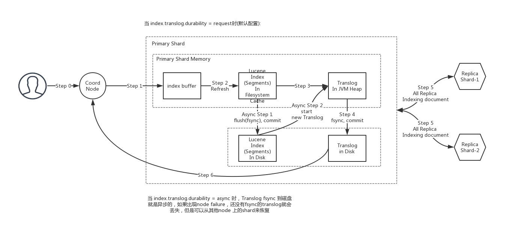

# Elasticsearch 关键技术点汇总

## 关键技术点

### 写入(索引)数据的详细流程

* 路由策略

```
shard_id = hash(routing_id) % num_of_shards
```

* refresh / flush / translog 机制, 异步sync / 生成segment

* Translog 机制

Changes to Lucene are only persisted to disk during a Lucene commit, which is a relatively expensive operation and so cannot be performed after every index or delete operation. Changes that happen after one commit and before another will be removed from the index by Lucene in the event of process exit or hardware failure.

Because Lucene commits are too expensive to perform on every individual change, each shard copy also has a transaction log known as its translog associated with it. All index and delete operations are written to the translog after being processed by the internal Lucene index but before they are acknowledged. In the event of a crash, recent transactions that have been acknowledged but not yet included in the last Lucene commit can instead be recovered from the translog when the shard recovers.

An Elasticsearch flush is the process of performing a Lucene commit and starting a new translog. Flushes are performed automatically in the background in order to make sure the translog doesn’t grow too large, which would make replaying its operations take a considerable amount of time during recovery. The ability to perform a flush manually is also exposed through an API, although this is rarely needed.

**Translog settings**

The data in the translog is only persisted to disk when the translog is fsynced and committed. In the event of hardware failure, any data written since the previous translog commit will be lost.

By default, Elasticsearch fsyncs and commits the translog every 5 seconds if index.translog.durability is set to async or if set to request (default) at the end of every index, delete, update, or bulk request. More precisely, if set to request, Elasticsearch will only report success of an index, delete, update, or bulk request to the client after the translog has been successfully fsynced and committed on the primary and on every allocated replica.

参见：https://github.com/elastic/elasticsearch/blob/v6.7.1/docs/reference/index-modules/translog.asciidoc

* segment merge

参考：https://blog.csdn.net/jiaojiao521765146514/article/details/83753215

* 写并发控制

* fsync

fsync 使用的是 `java.nio.channels.FileChannel.force()`, 详见：[FileChannle说明](http://ifeve.com/file-channel/)

> 总结写入流程，如下图：



图片来自：https://www.processon.com/view/link/5cb7f942e4b08b66b9b020a2

---

### 查询(搜索)的详细流程

* 路由策略

假如现在我们有一份索引5个shard和3个副本，当一个查询请求过来的时候，查询操作如何执行，在没有使用路由的情况下5个shard的数据肯定都要查询，然后查询5个shard时候到底查的是主shard还是replia都是随机的。

通过偏好查询，我们可以有更多的选择定制，比如我们可以设置只查询主shard，或者只查replia，或者仅仅查某几个节点的数据。

参见：https://blog.csdn.net/u010454030/article/details/73609231

* 普通查询原理


参考：http://ginobefunny.com/post/elasticsearch_interview_questions/

* 聚合查询原理

es将聚合分析主要分为如下4类：

1. Bucket：分桶类型，类似SQL中的GROUP BY语法

2. Metric：指标分析类型，如计算最大值、最小值、平均值等等

3. Pipeline：管道分析类型，基于上一级的聚合分析结果进行在分析

4. Matrix：矩阵分析类型

https://blog.csdn.net/qq_34646817/article/details/82594726

---

### 节点管理

#### 1. 节点 Heap 内存都是如何被占用的

**Segment Memory**

Segment不是file吗？segment memory又是什么？前面提到过，一个segment是一个完备的lucene倒排索引，而倒排索引是通过词典(Term Dictionary)到文档列表(Postings List)的映射关系，快速做查询的。由于词典的size会很大，全部装载到heap里不现实，因此Lucene为词典做了一层前缀索引(Term Index)，这个索引在Lucene4.0以后采用的数据结构是FST (Finite State
Transducer)。这种数据结构占用空间很小，Lucene打开索引的时候将其全量装载到内存中，加快磁盘上词典查询速度的同时减少随机磁盘访问次数。

下面是词典索引和词典主存储之间的一个对应关系图:

说了这么多，要传达的一个意思就是，ES的data node存储数据并非只是耗费磁盘空间的，为了加速数据的访问，每个segment都有会一些索引数据驻留在heap里。因此segment越多，瓜分掉的heap也越多，并且这部分heap是无法被GC掉的！ 理解这点对于监控和管理集群容量很重要，当一个node的segment memory占用过多的时候，就需要考虑删除、归档数据，或者扩容了。

怎么知道segment memory占用情况呢? CAT API可以给出答案。

`查看一个索引所有segment的memory占用情况`
`查看一个node上所有segment占用的memory总和`

那么有哪些途径减少data node上的segment memory占用呢？总结起来有三种方法：

```
1. 删除不用的索引。

2. 关闭索引（文件仍然存在于磁盘，只是释放掉内存）。需要的时候可以重新打开。

3. 定期对不再更新的索引做optimize (ES2.0以后更改为force merge api)。这Optimze的实质是对segme
```

**Filter Cache**

Filter cache是用来缓存使用过的filter的结果集的，需要注意的是这个缓存也是常驻heap，无法GC的。默认的10% heap size设置工作得够好了，如果实际使用中heap没什么压力的情况下，才考虑加大这个设置。

** Field Data cache [ES 2.0 以后基本都是通过mmap加载的doc values，不再占用heap空间，占用的是文件系统缓存] **

对搜索结果做排序或者聚合操作，需要将倒排索引里的数据进行解析，然后进行一次倒排。在有大量排序、数据聚合的应用场景，可以说field data cache是性能和稳定性的杀手。这个过程非常耗费时间，因此ES
2.0以前的版本主要依赖这个cache缓存已经计算过的数据，提升性能。但是由于heap空间有限，当遇到用户对海量数据做计算的时候，就很容易导致heap吃紧，集群频繁GC，根本无法完成计算过程。`ES2.0以后，正式默认启用Doc Values特性(1.x需要手动更改mapping开启)，将field data在indexing time构建在磁盘上，经过一系列优化，可以达到比之前采用field data cache机制更好的性能。`因此需要限制对field data cache的使用，最好是完全不用，可以极大释放heap压力。这里需要注意的是，排序、聚合字段必须为not analyzed。设想如果有一个字段是analyzed过的，排序的实际对象其实是词典，在数据量很大情况下这种情况非常致命。

**Bulk Queue**

Bulk Queue是做什么用的？当所有的bulk thread都在忙，无法响应新的bulk request的时候，将request在内存里排列起来，然后慢慢清掉。一般来说，Bulk queue不会消耗很多的heap，但是见过一些用户为了提高bulk的速度，客户端设置了很大的并发量，并且将bulk Queue设置到不可思议的大，比如好几千。这在应对短暂的请求爆发的时候有用，但是如果集群本身索引速度一直跟不上，设置的好几千的queue都满了会是什么状况呢？ 取决于一个bulk的数据量大小，乘上queue的大小，heap很有可能就不够用，内存溢出了。一般来说官方默认的thread

pool设置已经能很好的工作了，建议不要随意去“调优”相关的设置，很多时候都是适得其反的效果。

**Indexing Buffer**

Indexing Buffer是用来缓存新数据，当其满了或者refresh/flush interval到了，就会以segment file的形式写入到磁盘。这个参数的默认值是10% heap size。根据经验，这个默认值也能够很好的工作，应对很大的索引吞吐量。但有些用户认为这个buffer越大吞吐量越高，因此见过有用户将其设置为40%的。到了极端的情况，写入速度很高的时候，40%都被占用，导致OOM。

**Cluster State Buffer**

ES被设计成每个Node都可以响应用户的api请求，因此每个Node的内存里都包含有一份集群状态的拷贝。这个Cluster state包含诸如集群有多少个Node，多少个index，每个index的mapping是什么？有少shard，每个shard的分配情况等等(ES有各类stats api获取这类数据)。在一个规模很大的集群，这个状态信息可能会非常大的，耗用的内存空间就不可忽视了。并且在ES2.0之前的版本，state的更新是由Master Node做完以后全量散播到其他结点的。频繁的状态更新都有可能给heap带来压力。在超大规模集群的情况下，可以考虑分集群并通过tribe node连接做到对用户api的透明，这样可以保证每个集群里的state信息不会膨胀得过大。

**超大搜索聚合结果集的fetch**

ES是分布式搜索引擎，搜索和聚合计算除了在各个data node并行计算以外，还需要将结果返回给汇总节点进行汇总和排序后再返回。无论是搜索，还是聚合，如果返回结果的size设置过大，都会给heap造成很大的压力，特别是数据汇聚节点。

来自：https://www.jianshu.com/p/f41b706db6c7

---

### 集群管理

* 角色划分：master node / data node / coord node

* master 选主

https://blog.csdn.net/ailiandeziwei/article/details/87856210

https://www.easyice.cn/archives/164

https://blog.csdn.net/haixwang/article/details/80383942

https://www.cnblogs.com/woniu4/p/9348664.html

* 节点发现 Discovery

* cluster state

cluster state是全局性信息, 包含了整个群集中所有分片的元信息(规则, 位置, 大小等信息), 并保持每个每节的信息同步.

cluster state 是每个node上面都有吗？那如果发生了变更，如何同步呢？

在一个包含众多节点的集群中, ES是如何做到信息同步的呢? 原来ES的cluster state信息是由master节点维护的, 当它收到data节点的状态更新变化后, 就把这些信息依次广播到其他节点, 仅此而已.

* pending task

当集群出问题时，我们在cat health时会看到pending task，pending task到底是什么东西？

只有master节点能处理集群元数据层面的改变任务。大多数情况下，master可以处理，但当集群元数据改变的速度超过了master节点处理的速度时，将会导致这些元数据操作的任务被缓存入队列中，即pending tasks。pending task API 将会显示队列中被挂起的所有的集群`元数据改变的任务`。
当cluster state 太大的时候，一些改变很容易更新其cluster state，更新一次cluster state会消耗很多cpu还有传送到其他节点的网络带宽，会花费较多的时间。


* 跨集群查询

* 多租户

---

### Lucene 原理

* 倒排索引，相关性搜索：TF/IDF 原理

* 文件结构

* doc values / 文件系统缓存

doc values 是lucence写入倒排索引的同时构建的，文件后缀dvd 存储 doc values数据，dvm 存储doc values元数据。通过mmap的方式，加载到文件系统缓存中，不放在Es node jvm heap 中，适合用于排序，聚合，具体的例子见官方：

https://www.elastic.co/guide/en/elasticsearch/guide/current/docvalues.html

https://blog.csdn.net/zteny/article/details/84627990

---

### ES 调优经验

* 常见的调优策略：

https://mp.weixin.qq.com/s/Fvf9JcOc5oSRlLdHB4tYxA

* 如何提高数据写入速度

https://www.jianshu.com/p/5eeeeb4375d4

https://qbox.io/blog/maximize-guide-elasticsearch-indexing-performance-part-1

https://qbox.io/blog/maximize-guide-elasticsearch-indexing-performance-part-2

https://qbox.io/blog/maximize-guide-elasticsearch-indexing-performance-part-3

---

## FAQ

1. Elasticsearch是如何实现Master选举的？

TODO: 用Paxos了吗？备选节点`node.master=true`为什么可以有偶数个？

2. 节点之间如何实现互相发现？

3. Master节点如何Failover, 如何防止brain split ?

4. Elasticsearch如何实现Document Update/Delete ?

```
删除和更新也都是写操作，但是Elasticsearch中的文档是不可变的，因此不能被删除或者改动以展示其变更；

delete，update是通过Lucene的.del文件实现的。

[delete]磁盘上的每个段都有一个相应的.del文件。当删除请求发送后，文档并没有真的被删除，而是在.del文件中被标记为删除。
该文档依然能匹配查询，但是会在结果中被过滤掉。当段合并时，在.del文件中被标记为删除的文档将不会被写入新段。

[update]在新的文档被创建时，Elasticsearch会为该文档指定一个版本号，当执行更新时，旧版本的文档在.del文件中被标记为删除，新版本的文档被索引到一个新段。
旧版本的文档依然能匹配查询，但是会在结果中被过滤掉。
```

5. 索引数据的详细流程 ?

6. 搜索的详细流程 ?

7. 性能调优？

8. 如何做聚合？聚合的结果是100%准确吗？

9. Lucene原理是什么？

10. 分布式相关问题：es的节点有哪些角色，都是什么功能；节点之间如何通信；如何做节点发现？

master, data, searcher, coord(client请求到的节点，动态不固定)

11. 分布式相关问题：分片创建策略，副本复制策略, 读写数据时的分片路由策略，副本容错策略，如何做到读写的计算请求尽可能负载均衡 ?

12. doc value原理及用法？
 
13. Index merge 原理？

14. Index recovery 原理？

15. 如何从ES获取大量数据？ES内部是如何实现的？

Scroll API的实现。

---

## References

http://ginobefunny.com/post/elasticsearch_interview_questions/

Lucene的索引文件格式(1): http://www.cnblogs.com/forfuture1978/archive/2009/12/14/1623597.html

Lucene的索引文件格式(2): http://www.cnblogs.com/forfuture1978/archive/2009/12/14/1623599.html

ES内存那点事 https://elasticsearch.cn/article/32

ES常见问题 https://www.jianshu.com/p/4e1154cbf86f

ES 读写原理: https://www.cnblogs.com/licongyu/p/5466992.html

ES 数据副本原理：https://www.jianshu.com/p/98d96964a45e

