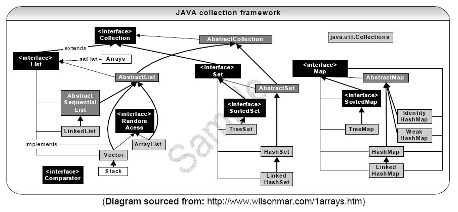
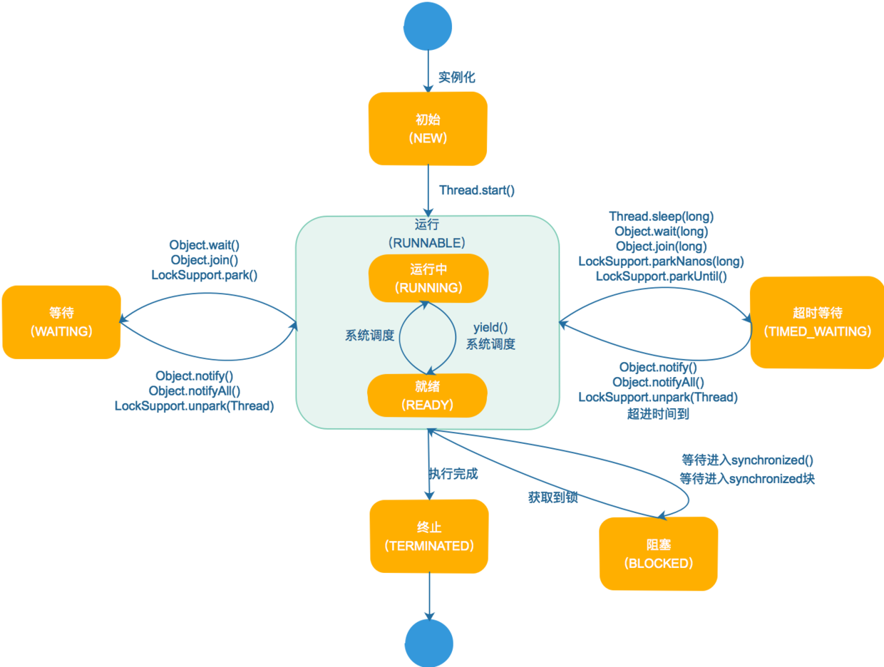
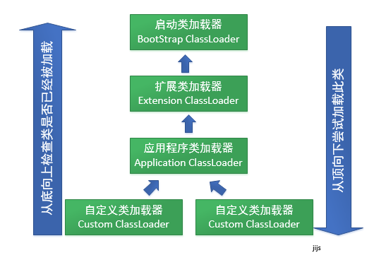
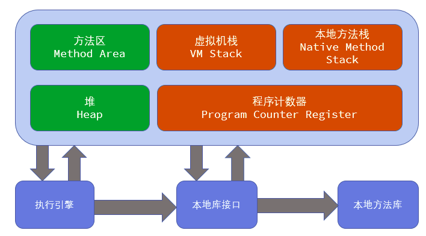
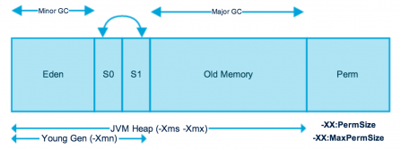

## [已废弃] Java


---

请移步至新总结的Java 笔记 [新java笔记](./java2.md)

---

### collections 



### Java 并发编程

1. Java线程生命周期／状态切换



2. Thread, 完整分类图：

java.util.concurrent: 


`ThreadPoolExecutor`, `ScheduledThreadPoolExecutor`是其中两个重要的线程池实现。ThreadPoolExecutor源码分析参考：[ThreadPoolExecutor源码详解](https://my.oschina.net/xionghui/blog/494698)

在生产环境下我们实现的`BoundedThreadPool`，特点是：

4. 线程同步和线程安全

* synchonized

* volatile

JVM 可见性 

https://www.cnblogs.com/fengzheng/p/9070268.html

http://www.importnew.com/27002.html

http://ifeve.com/how-to-use-volatile/

https://www.cnblogs.com/paddix/p/5428507.html

https://www.cnblogs.com/dolphin0520/p/3920373.html

https://www.cnblogs.com/chengxiao/p/6528109.html


* transient

* CAS

https://www.cnblogs.com/chengxiao/p/6789109.html

https://mp.weixin.qq.com/s/VeHq-LFPTYbtO6DsHKwngw

5. 线程通信

* BlockingQueue等Queue的实现

* Future获取线程执行结果

6. Java 如何实现无锁的链表(CAS)


### 常见设计模式在Java中的实现

1. 实现线程安全的单例模式

```
public class Singleton {  
  
    /* 私有构造方法，防止被实例化 */  
    private Singleton() {  
    }  
  
    /* 此处使用一个内部类来维护单例 */  
    private static class SingletonFactory {  
        private static Singleton instance = new Singleton();  
    }
  
    /* 获取实例 */  
    public static Singleton getInstance() {  
        return SingletonFactory.instance;  
    }  
}  
```

参考：[Java之美之设计模式](http://blog.csdn.net/zhangerqing/article/details/8194653), 其中也列举了几个错误的单例实现方式。


### JVM 类的加载机制

从类被加载到虚拟机内存中开始，到卸御出内存为止，它的整个生命周期分为7个阶段，加载(Loading)、验证(Verification)、准备(Preparation)、
解析(Resolution)、初始化(Initialization)、使用(Using)、卸御(Unloading)。其中验证、准备、解析三个部分统称为连接。
7个阶段发生的顺序如下：

!

JVM提供了3种类加载器：

1、启动类加载器（Bootstrap ClassLoader）：负责加载 JAVA_HOME\lib 目录中的，或通过-Xbootclasspath参数指定路径中的，且被虚拟机认可（按文件名识别，如rt.jar）的类。

2、扩展类加载器（Extension ClassLoader）：负责加载 JAVA_HOME\lib\ext 目录中的，或通过java.ext.dirs系统变量指定路径中的类库。

3、应用程序类加载器（Application ClassLoader）：负责加载用户路径（classpath）上的类库。

https://www.baeldung.com/java-classloaders

https://stackoverflow.com/questions/11759414/java-how-to-load-different-versions-of-the-same-class



双亲委派机制能很好地解决类加载的统一性问题。对一个 Class 对象来说，如果类加载器不同，即便是同一个字节码文件，生成的 Class 对象也是不等的。也就是说，类加载器相当于 Class 对象的一个命名空间。双亲委派机制则保证了基类都由相同的类加载器加载，这样就避免了同一个字节码文件被多次加载生成不同的 Class 对象的问题。但双亲委派机制仅仅是Java 规范所推荐的一种实现方式，它并不是强制性的要求。

近年来，很多热部署的技术都已不遵循这一规则，如 OSGi 技术就采用了一种网状的结构，而非双亲委派机制。

参见[JVM类加载的那些事](http://www.importnew.com/23650.html), [Java 类加载机制详解](http://www.jianshu.com/p/808a36134da5), [JVM 类加载机制深入浅出](http://www.jianshu.com/p/3cab74a189de)

### JVM 进程、线程内存模型

JVM内存模型：




堆内存模型：

堆内存是所有线程共有的，可以分为两个部分：年轻代和老年代。下图中的Perm代表的是永久代，但是注意永久代并不属于堆内存中的一部分，同时jdk1.8之后永久代也将被移除。



GC(垃圾回收器)对年轻代中的对象进行回收被称为Minor GC，用通俗一点的话说年轻代就是用来存放年轻的对象，年轻对象是什么意思呢？
年轻对象可以简单的理解为没有经历过多次垃圾回收的对象，如果一个对象经历过了一定次数的Minor GC，JVM一般就会将这个对象放入到年老代，而JVM对年老代的对象的回收则称为Major GC。

如上图所示，年轻代中还可以细分为三个部分，我们需要重点关注这几点：

1. 大部分对象刚创建的时候，JVM会将其分布到Eden区域。

2. 当Eden区域中的对象达到一定的数目的时候，就会进行Minor GC，经历这次垃圾回收后所有存活的对象都会进入两个Suvivor Place中的一个。

3. 同一时刻两个Suvivor Place，即s0和s1中总有一个总是空的。

4. 年轻代中的对象经历过了多次的垃圾回收就会转移到年老代中。

参考[JVM内存模型解析](https://www.ziwenxie.site/2017/06/01/java-jvm-memory-model/)

### GC原理及调优(包括常用参数)

G1 vs CMS:

G1使内存空余空间更连续，GC导致的Pause时间更短，比CMS消耗更多的CPU资源，适合大Heap应用使用。

参考：[淺談 Java GC 原理、調教和新發展](https://www.slideshare.net/leonjchen/java-gc-javadeveloperdaytw), 
[Memory Management in the Java HotSpot™ Virtual Machine](http://www.oracle.com/technetwork/java/javase/memorymanagement-whitepaper-150215.pdf),
[JVM垃圾回收算法及回收器详解](https://www.ziwenxie.site/2017/07/24/java-jvm-gc),
[Getting Started with the G1 Garbage Collector](http://www.oracle.com/webfolder/technetwork/tutorials/obe/java/G1GettingStarted/index.html),
[Java Garbage Collection Basics](http://www.oracle.com/webfolder/technetwork/tutorials/obe/java/gc01/index.html),
[JVM初探：内存分配、GC原理与垃圾收集器](http://www.importnew.com/23035.html),
[理解Java垃圾回收机制](http://jayfeng.com/2016/03/11/%E7%90%86%E8%A7%A3Java%E5%9E%83%E5%9C%BE%E5%9B%9E%E6%94%B6%E6%9C%BA%E5%88%B6/)

### jdk常用数据结构的实现方式和比较(重点ArrayList, LinkedList, HashMap, HashTable, LinkedHashMap,ConcurrentHashMap)

### 反射

https://www.journaldev.com/1789/java-reflection-example-tutorial

### 依赖注入

https://github.com/google/guice

### Java8 函数式编程与并行计算

http://lvheyang.com/?p=87

### 依赖管理

https://dzone.com/articles/solving-dependency-conflicts-in-maven


---

### FAQ

1. 如何判断一个对象是否存活?(或者GC对象的判定方法) ?

（1）引用计数法[JVM 没有用]，
（2）可达性分析[JVM 在用]，什么是GC ROOT ? 

https://www.jianshu.com/p/108ddab3ad3f

2. HashMap vs HashTable vs ConcurrentHashMap ?

```
# 先说一下HashMap的实现：
HashMap内部是通过一个数组实现的，只是这个数组比较特殊，数组里存储的元素是一个Entry实体(jdk 8为Node)，
这个Entry实体主要包含key、value以及一个指向自身的next指针。HashMap是基于hashing实现的，
当我们进行put操作时，根据传递的key值得到它的hashcode，然后再用这个hashcode与数组的长度进行模运算，
得到一个int值，就是Entry要存储在数组的位置（下标）；当通过get方法获取指定key的值时，
会根据这个key算出它的hash值（数组下标），根据这个hash值获取数组下标对应的Entry，
然后判断Entry里的key，hash值或者通过equals()比较是否与要查找的相同，如果相同，返回value，否则的话，
遍历该链表（有可能就只有一个Entry，此时直接返回null），直到找到为止，否则返回null。

HashMap之所以在每个数组元素存储的是一个链表，是为了解决hash冲突问题，当两个对象的hash值相等时，
那么一个位置肯定是放不下两个值的，于是hashmap采用链表来解决这种冲突，hash值相等的两个元素会形成一个链表。
```

```
jdk 1.6版: ConcurrenHashMap可以说是HashMap的升级版，ConcurrentHashMap是线程安全的，但是与Hashtablea相比，实现线程安全的方式不同。
Hashtable是通过对hash表结构进行锁定，是阻塞式的，当一个线程占有这个锁时，其他线程必须阻塞等待其释放锁。
ConcurrentHashMap是采用分离锁的方式，它并没有对整个hash表进行锁定，而是局部锁定，也就是说当一个线程占有这个局部锁时，不影响其他线程对hash表其他地方的访问。

具体实现:ConcurrentHashMap内部有一个Segment<K,V>数组,该Segment对象可以充当锁。Segment对象内部有一个HashEntry<K,V>数组，
于是每个Segment可以守护若干个桶(HashEntry),每个桶又有可能是一个HashEntry连接起来的链表，存储发生碰撞的元素。

每个ConcurrentHashMap在默认并发级下会创建包含16个Segment对象的数组，每个数组有若干个桶，当我们进行put方法时，通过hash方法对key进行计算，
得到hash值，找到对应的segment，然后对该segment进行加锁，然后调用segment的put方法进行存储操作，此时其他线程就不能访问当前的segment，
但可以访问其他的segment对象，不会发生阻塞等待。

jdk 1.8版 在jdk 8中，ConcurrentHashMap不再使用Segment分离锁，而是采用一种乐观锁CAS算法来实现同步问题，
但其底层还是“数组+链表->红黑树”的实现。

```

3. LinkedHashMap 为什么能做到按照元素插入顺序访问，而HashMap做不到 ?

```
LinkedHashMap也是基于HashMap实现的，不同的是它定义了一个Entry header，这个header不是放在Table里，它是额外独立出来的。
LinkedHashMap通过继承hashMap中的Entry,并添加两个属性Entry before,after,和header结合起来组成一个双向链表，
来实现按插入顺序或访问顺序排序。LinkedHashMap定义了排序模式accessOrder，该属性为boolean型变量，
对于访问顺序，为true；对于插入顺序，则为false。一般情况下，不必指定排序模式，其迭代顺序即为默认为插入顺序。

```

4. Java中有哪几种锁?

```

自旋锁: 自旋锁在JDK1.6之后就默认开启了。基于之前的观察，共享数据的锁定状态只会持续很短的时间，为了这一小段时间而去挂起和恢复线程有点浪费，所以这里就做了一个处理，让后面请求锁的那个线程在稍等一会，但是不放弃处理器的执行时间，看看持有锁的线程能否快速释放。为了让线程等待，所以需要让线程执行一个忙循环也就是自旋操作。

在jdk6之后，引入了自适应的自旋锁，也就是等待的时间不再固定了，而是由上一次在同一个锁上的自旋时间及锁的拥有者状态来决定

偏向锁: 在JDK1.之后引入的一项锁优化，目的是消除数据在无竞争情况下的同步原语。进一步提升程序的运行性能。 偏向锁就是偏心的偏，意思是这个锁会偏向第一个获得他的线程，如果接下来的执行过程中，改锁没有被其他线程获取，则持有偏向锁的线程将永远不需要再进行同步。偏向锁可以提高带有同步但无竞争的程序性能，也就是说他并不一定总是对程序运行有利，如果程序中大多数的锁都是被多个不同的线程访问，那偏向模式就是多余的，在具体问题具体分析的前提下，可以考虑是否使用偏向锁。

轻量级锁: 为了减少获得锁和释放锁所带来的性能消耗，引入了“偏向锁”和“轻量级锁”，所以在Java SE1.6里锁一共有四种状态，无锁状态，偏向锁状态，轻量级锁状态和重量级锁状态，它会随着竞争情况逐渐升级。锁可以升级但不能降级，意味着偏向锁升级成轻量级锁后不能降级成偏向锁。这种锁升级却不能降级的策略，目的是为了提高获得锁和释放锁的效率，下文会详细分析

```

5. volatile 关键词的作用？ 

volatile是一个特殊的修饰符，只有成员变量才能使用它。在Java并发程序缺少同步类的情况下，多线程对成员变量的操作对其它线程是透明的。
`volatile变量可以保证下一个读取操作会在前一个写操作之后发生`。

6. Java 异常机制? checked exceptions vs unchecked exceptions ?

checked exceptions : instances or subclass of Exception

unchecked exception: instances or subclass of RuntimeException

7. abstract class是什么，interface是什么，分别在什么场景下使用？

https://stackoverflow.com/questions/761194/interface-vs-abstract-class-general-oo?rq=1

http://www.geeksforgeeks.org/difference-between-abstract-class-and-interface-in-java/

8. 【高级问题】如何实现模块化、插件化、易扩展，简洁、高效、松耦合的Java应用？

有多种方案，如：

(1) 反射机制：Class.forName()

(2) ServiceLoader：`java.util.ServiceLoader`:

http://www.logicbig.com/tutorials/core-java-tutorial/java-se-api/service-loader/

https://www.jianshu.com/p/7601ba434ff4

(3) 注解

(4) 范型

(5) OSGi Services

---

#### Java 并发编程知识汇总

1. volatile/synchronized

[volatile关键词](http://mp.weixin.qq.com/s?__biz=MzU0OTk3ODQ3Ng==&mid=2247484058&idx=1&sn=d5c1533204ea655e65947ec57f924799&chksm=fba6ea99ccd1638f945c585cf3b2df6f4d4112b17ea3648730d50fdb5508555d5f30316f4186&mpshare=1&scene=24&srcid=#rd)

2. nio

3. 线程，进程同步机制

4. 死锁

5. java 并发库

[线程池讲解](http://mp.weixin.qq.com/s?__biz=MzU0OTk3ODQ3Ng==&mid=2247484608&idx=1&sn=cf5d9f47cbdac1751565ee3448804de6&chksm=fba6ecc3ccd165d51426a04825d9ac35e16061ee81a9d3d7b85f526755938ad88e714f0dc74d&mpshare=1&scene=24&srcid=#rd)

[ConcurrentHashMap](http://mp.weixin.qq.com/s?__biz=MzU0OTk3ODQ3Ng==&mid=2247484526&idx=1&sn=6783cd49c3c25e75de16aaa61bbf6ee7&chksm=fba6ec6dccd1657bcd57abaa68d15a8ad52b8011eaa751d637bf279f5a35ec21e80b7b81243d&mpshare=1&scene=24&srcid=#rd)

---

### References
 
http://www.jianshu.com/p/04c0d796d877

http://www.blogjava.net/xylz/archive/2010/06/30/324915.html

Java开发中的23种设计模式详解 http://www.cnblogs.com/maowang1991/archive/2013/04/15/3023236.html

Java 并发编程总结 http://ginobefunny.com/post/java_concurrent_interview_questions/

2016年Java 面试题总结 http://maosheng.iteye.com/blog/2270687

[《Java Concurrency In Practice》](./java_slides/Java_Concurrency_In_Practice.pdf)

《Java8 函数式编程》

《深入理解Java虚拟机》

### TODO

CopyOnWriteArrayList, ConcurrentHashMap 不是强一致的？ 

什么是 CAS, mvcc,

如何实现无锁的链表。

JVM4种锁的级别。

NIO

面试小结之IO篇: http://ginobefunny.com/post/java_nio_interview_questions/

面试小结之JVM篇: http://ginobefunny.com/post/jvm_interview_questions/

《深入理解Java虚拟机》读书笔记1：Java技术体系、Java内存区域和内存溢出异常: http://ginobefunny.com/post/deep_in_jvm_notes_part1/

《深入理解Java虚拟机》读书笔记2：垃圾收集器与内存分配策略: http://ginobefunny.com/post/deep_in_jvm_notes_part2/

《深入理解Java虚拟机》读书笔记3：虚拟机性能监控与调优实战: http://ginobefunny.com/post/deep_in_jvm_notes_part3/

《Java 8函数式编程》读书笔记: http://ginobefunny.com/post/java8_lambda_notes/

Guice简明教程: http://ginobefunny.com/post/learning_guice/

---

# References CAS 原理

https://blog.csdn.net/mmoren/article/details/79185862

https://www.cnblogs.com/javalyy/p/8882172.html

https://blog.csdn.net/v123411739/article/details/79561458

https://www.cnblogs.com/kisty/p/5408264.html

https://www.jianshu.com/p/ae25eb3cfb5d

https://www.jianshu.com/p/fb6e91b013cc

http://ifeve.com/compare-and-swap/


 
