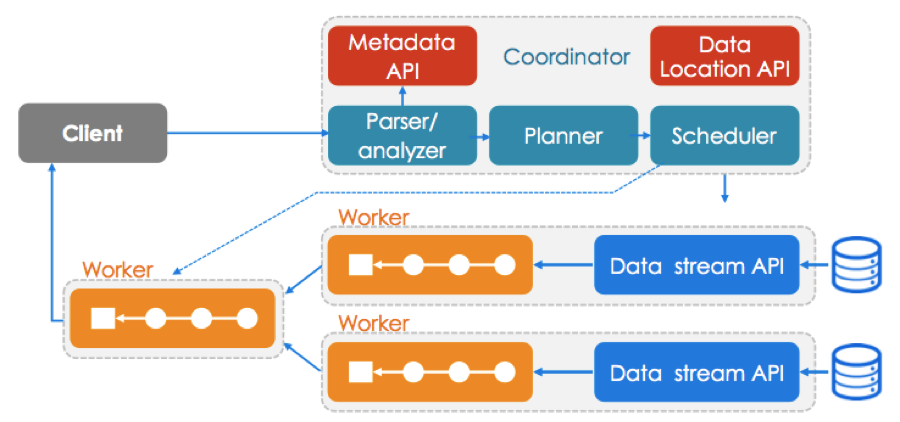
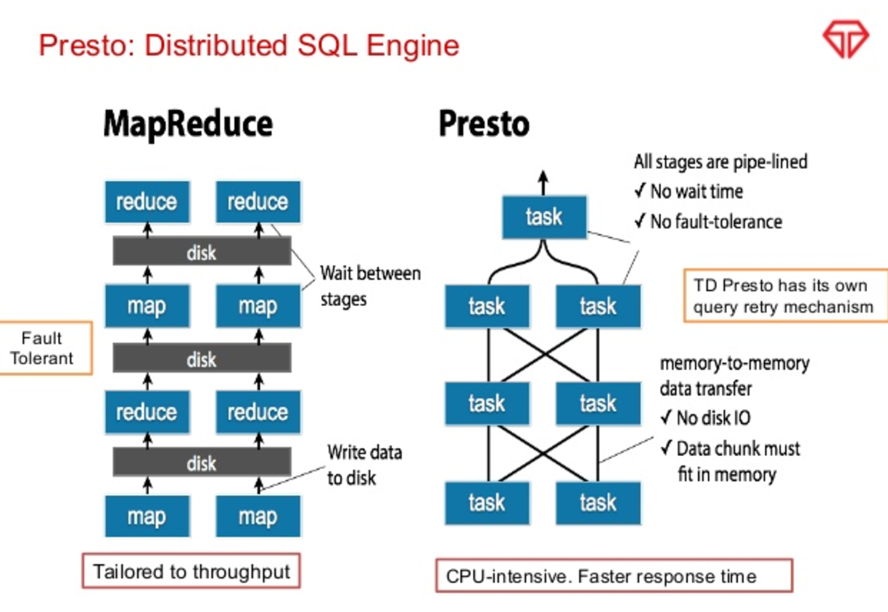
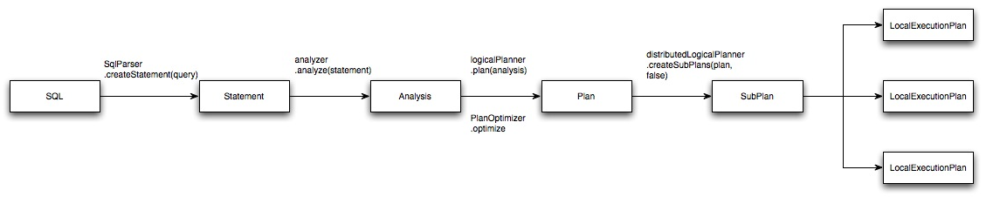

# Presto 关键技术点

## 架构

Presto查询引擎是一个Master-Slave的架构，由一个Coordinator节点，一个Discovery Server节点，多个Worker节点组成，Discovery Server通常内嵌于Coordinator节点中。
Coordinator负责解析SQL语句，生成执行计划，分发执行任务给Worker节点执行。Worker节点负责实际执行查询任务。Worker节点启动后向Discovery Server服务注册，
Coordinator从Discovery Server获得可以正常工作的Worker节点。如果配置了Hive Connector，需要配置一个Hive MetaStore服务为Presto提供Hive元信息，Worker节点与HDFS交互读取数据。

## MPP vs MapReduce

## 概念
 
Query -> Stage -> Task ?

Split ? Operator ?

Query Plan -> Plan Fragments ?

## SQL 编译过程

LocalExecutionPlan是在每个worker节点上执行。

---

## FAQ

1. "Query", "Stage","Task","Split","Driver","Pipeline", "Operator" ?

A query is a single execution of SQL. 

A query has stages. A stage executes a query plan fragment. 

A stage has tasks. All tasks in the stage execute the same plan fragment.  Generally there is at most one Task per stage per worker node, but the system can be configured to allow multiple. 

A task has pipelines. A pipeline is basically a template for drivers.  When the plan fragment in a stage is broken down into operators, we may end up with multiple pipelines.  For example, a join ends up with a pipeline for the "probe" and a pipeline for the “build". 

A pipeline has drivers.  A driver is an instance of the template in a pipeline.  Typically there is one of these per split.  Some pipelines are not created based on splits and only have a single driver instance. 

A driver has operators.  The driver contains a list of operators.  The driver “drives” pages of data through the operator chain. 

Operators do the actual data processing in Presto.  Example operators are: table scan, filter, project, aggregate, join, etc. An operator optionally consumes pages and optionally produces output pages. 

A split is a part of a table. 

2. 为什么Presto快？

3. Presto如何对SQL的逻辑计划进行拆分，以达到以较高的并行度来执行这个计划 ?

---

## References

Presto实现原理和美团的使用实践 https://tech.meituan.com/presto.html

Presto: Interacting with petabytes of data at Facebook https://www.facebook.com/notes/facebook-engineering/presto-interacting-with-petabytes-of-data-at-facebook/10151786197628920

Presto overview https://www.slideshare.net/zhusx/presto-overview

https://www.slideshare.net/GuorongLIANG/facebook-presto-presentation

http://prestodb.rocks/internals/the-fundamentals-data-distribution/

盘点SQL on Hadoop中用到的主要技术: http://sunyi514.github.io/2014/11/15/%E7%9B%98%E7%82%B9sql-on-hadoop%E4%B8%AD%E7%94%A8%E5%88%B0%E7%9A%84%E4%B8%BB%E8%A6%81%E6%8A%80%E6%9C%AF/

---

## TODO

https://www.slideshare.net/AGrishchenko/mpp-vs-hadoop

https://0x0fff.com/hadoop-vs-mpp/

https://www.linkedin.com/pulse/hadoop-vs-mpp-anoop-kumar-goyal

https://venturebeat.com/2013/03/19/how-to-conquer-big-data-with-mapreduce-mpp/

http://www.vldbsolutions.com/blog/mapreduce-mpp/

https://www.flydata.com/blog/introduction-to-massively-parallel-processing/

http://datascientists.info/blog/2013/04/26/hadoop-mpp/

http://www.zdnet.com/article/mapreduce-and-mpp-two-sides-of-the-big-data-coin/

《Presto技术内幕》 链接：https://pan.baidu.com/s/1zKtT_ETvG0QwRISkowYSSw  提取码：pbxl 

Presto中的分组聚合查询流程 https://zhuanlan.zhihu.com/p/54385845

Presto 数据如何进行shuffle https://zhuanlan.zhihu.com/p/61565957

Presto 由Stage到Task的旅程 https://zhuanlan.zhihu.com/p/55785284

Presto的ETL之路 https://zhuanlan.zhihu.com/p/53996153

Presto Codegen简介与优化尝试 https://zhuanlan.zhihu.com/p/53469238

Presto中的Hash Join https://zhuanlan.zhihu.com/p/54731892

Presto 专栏 https://zhuanlan.zhihu.com/presto-cn

