## Spark 关键技术点整理 

---


#### 1. spark 架构(Spark On Yarn):

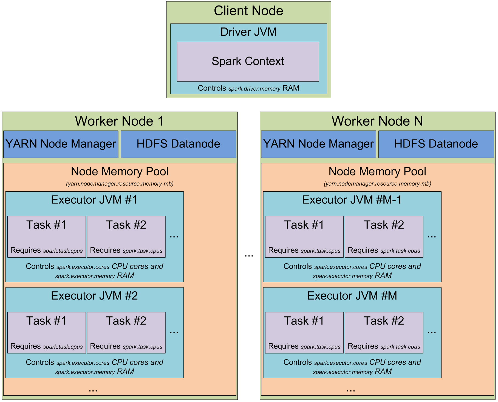

[spark 架构详细解释](https://0x0fff.com/spark-architecture/)

备注：Application Master是Yarn上的概念，不是Spark里面的概念。

---

#### 2. Spark执行原理

https://www.slideshare.net/datamantra/core-services-behind-spark-job-execution

---

#### 3. Spark Stateful Streaming Processing

https://www.slideshare.net/datamantra/state-management-in-structured-streaming

---

FAQ

Q1: RDD是什么？

A1: RDD是分布式的数据集。RDD划分成多个Partition分布到集群中，分区的多少涉及对这个RDD进行并行计算的粒度。RDD依赖关系，分两种：窄依赖(Narrow Dependencies)和宽依赖(Wide Dependencies)。
窄依赖是指每个父RDD都之多被一个RDD的分区使用，而宽依赖是多个子RDD的分区依赖一个父RDD的分区。例如map，filter操作是窄依赖，而join，groupbykey是宽依赖。

`TODO:` RDD的每个Partition 有副本？

Q2: 任务的调度？什么是DAG ? Spark DAG 的详细结构？

```
核心：DAGScheduler, TaskScheduler

DAGScheduler 负责划分Stage, 把不需要shuffle的transformations 合并到同一个Stage执行。

https://stackoverflow.com/a/30685279/1145750
```


 
Q3: 如何做容错（失败的任务和执行慢的任务）？

两种容错方式：Checkpoint , Lineage

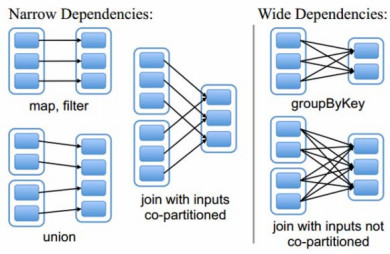

```
RDD 的容错机制：

RDD的基本容错语义。
* 一个RDD是不可变的、确定可重复计算的、分布式数据集。每个RDD记住一个确定性操作的谱系(lineage)，这个谱系用在容错的输入数据集上来创建该RDD。
* 如果任何一个RDD的分区因为节点故障而丢失，这个分区可以通过操作谱系从源容错的数据集中重新计算得到。
* 假定所有的RDD transformations是确定的，那么最终转换的数据是一样的，不论Spark机器中发生何种错误。

RDDs track the graph of transformations that built them (their lineage) to rebuild lost data
	
通过判断DAG中lineage的长度和是否存在宽依赖，来确定RDD的分区丢失后重算的代价。
http://blog.csdn.net/jasonding1354/article/details/46882585
```

```
TODO: 根据lineage计算，那么最原始的数据源会一直保存在Spark内存中？（问题是计算RDD的数据源怎么来的？）

Spark does not replicate data in hdfs.

Spark arranges the operations in DAG graph.Spark builds RDD lineage. If a RDD is lost they can be rebuilt with the help of lineage graph. 
So there is no need of data replication as the RDDS can be recalculated from the lineage graph.

However if we persist RDDS with replicated storage levels(such as MEMORY_ONLY_2, MEMORY_AND_DISK_2) then the data may be replicated across nodes.

另外见我在stackoverflow comment中的疑问？
https://stackoverflow.com/questions/31624622/is-there-a-way-to-change-the-replication-factor-of-rdds-in-spark
```

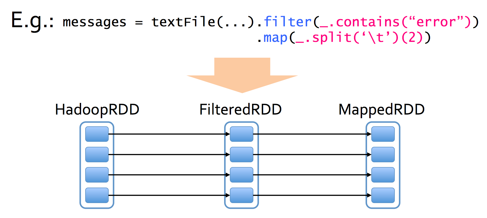
    
    
```
(1) 计算与数据就近原则。在作业中如果某个任务执行缓慢，系统会在其他节点上执行该任务的副本，与MapReduce推测执行做法类似，取最先得到的结果作为最终的结果。
   
(2) TODO: 对于Spark Streaming, receiver接收数据后生成的RDD的每一个Partition，在内存中是多副本存储？
    
(3) Checkpoint 和 WAL 解决数据丢失。
https://www.slideshare.net/differentsachin/apache-spark-introduction-to-spark-streaming-and-deep-dive-57671774
```

对于spark streaming中收到的数据，[默认保存2份](https://spark.apache.org/docs/latest/streaming-programming-guide.html#caching--persistence)：

For input streams that receive data over the network (such as, Kafka, Flume, sockets, etc.), the default persistence level is set to replicate the data to two nodes for fault-tolerance.


Q4: Job/Stage/Task的并行执行关系？

一个Action生成一个Job，一次shuffle划分2个stage，task根据RDD Partition 一一对应生成。

Job中的Stage是通过DAGScheduler划分的，一次shuffle（宽依赖）划分2个stage，同一个Job中的不同Stage不能并行，同一个Stage中的不同Task可以并行。Task是执行的最小单元。

Q5: Spark vs MapReduce

A5: 并不是因为"内存计算"。而是内存迭代计算，任务依赖关系用DAG表示，支持map，reduce以外更丰富的算子。 

```
https://0x0fff.com/spark-misconceptions/

In general, Spark is faster than MapReduce because of:

1. Faster task startup time. Spark forks the thread, MR brings up a new JVM

2. Faster shuffles. Spark puts the data on HDDs only once during shuffles, MR do it 2 times

3. Faster workflows. Typical MR workflow is a series of MR jobs, each of which persists data to HDFS between iterations. 
Spark supports DAGs and pipelining, which allows it to execute complex workflows without intermediate data materialization (unless you need to “shuffle” it)

4. Caching. It is doubtful because at the moment HDFS can also utilize the cache, but in general Spark cache is quite good, 
especially its SparkSQL part that caches the data in optimized column-oriented form

All of these gives Spark good performance boost compared to Hadoop, which can really be up to 100x for short-running jobs, 
but for real production workloads it won’t exceed 2.5x – 3x at most.
```

Q6: Spark 如何做存储（内存/磁盘）管理？

A6: spark JVM 内存模型：

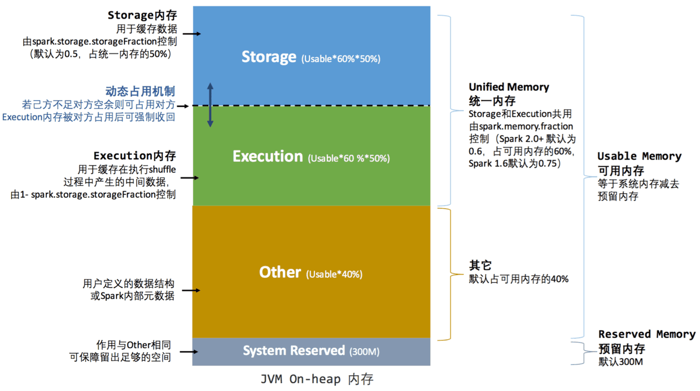

[spark1.6+ 内存模型详细解释1-part1](http://www.jianshu.com/p/3981b14df76b), [spark1.6+ 内存模型详细解释1-part2](http://www.jianshu.com/p/58288b862030)

[spark1.6+ 内存模型详细解释 2](https://0x0fff.com/spark-memory-management/)

* Execution Memory
    
    * storage for data needed during tasks execution
    
    * shuffle-related data
    
* Storage Memory
    
    * storage of cached RDDs and broadcast variables
    
    * possible to borrow from execution memory (spill otherwise)
    
    * safeguard value is 50% of Spark Memory when cached blocks are immune to eviction
    
* User Memory
    
    * user data structures and internal metadata in Spark
    
    * safeguarding against OOM

* Reserved memory
    
    * memory needed for running executor itself and not strictly related to Spark
    
 参考《图解Spark》第五章 Spark存储管理

Q7: Spark 调度策略？

Spark 的调度分为应用间调度：不同的Spark App之间的调度，调度的对象是spark app, 例如在Yarn上有FIFO, Fair两种；应用内调度的对象是Spark Job, 也分为FIFO, Fair两种。

对于应用内的Fair模式的调度，支持按照自定义的多个`pool`来区分调度，pool有3个重要的参数`schedulingMode`, `weight`, `minShare`, 
具体含义见[Spark Job Scheduling](http://spark.apache.org/docs/latest/job-scheduling.html#scheduling-within-an-application)

Spark应用内（同一个sparkContext），可以配置一个应用内的多个`TaskSetManager`间调度为FIFO还是FAIR。以Spark的Thrift Server为例，
考虑一个问题，用户a的作业很大，需要处理上T的数据，且SQL也非常复杂，而用户b的作业很简单，可能只是Select查看前面几条数据而已。
由于用户a、b都在同一个SparkContext里，所以其调度完全由Spark决定；如果按先入先出的原则，可能用户b要等好一会，
才能从用户a的牙缝里扣出一点计算资源完成自己的这个作业，这样对用户b就不是那么友好了。

比较好的做法是配置Spark应用内各个TaskSetManager的调度算法为`Fair`，不需要等待用户a的资源，用户b的作业可以尽快得到执行。
这里需要注意，FIFO并不是说用户b只能等待用户a所有Task执行完毕才能执行，而只是执行的很迟，并且不可预料。
从实测情况来看，配置为FIFO，用户b完成时间不一定，一般是4-6s左右；而配置为FAIR，用户b完成时间几乎是不变的，几百毫秒。

应用内调度的配置项在
```
{spark_base_dir}/conf/spark_default.conf：spark.scheduler.mode FAIR。
```

参考：http://spark.apache.org/docs/latest/job-scheduling.html#scheduling-within-an-application

参考：https://ieevee.com/tech/2016/07/11/spark-scheduler.html#

Q8: Shuffle 原理和优化？

[Spark Shuffle原理](https://0x0fff.com/spark-architecture-shuffle/)

During the shuffle `ShuffleMapTask` writes blocks to local drive, and then the task in the next stages `fetches these blocks` (compared to reduce in hadoop) over the network.

```
# shuffle 的策略：
before spark 1.2

hash shuffle:

after spark 1.2

sort shuffle:

* Incoming records accumulated and sorted in memory according their target partition ids

* Sorted records are written to file or multiple files if spilled and then merged

* Index file stores offsets of the data blocks in the data file

备注：Sort Shuffle 中的sort是指输出的文件内容，按照target rdd的partition id 排序，不是对数据进行排序。

```

Sort Shuffle 原理图如下：


参考：[Shuffle 原理1](http://datastrophic.io/core-concepts-architecture-and-internals-of-apache-spark/)

参考：[Shuffle 原理2](https://github.com/JerryLead/SparkInternals/blob/master/markdown/4-shuffleDetails.md)

Q9: Spark Join 优化?

A9: 

[Spark Join的3种实现](./bigdata_stack_slides/spark-joins.pdf)

https://www.slideshare.net/databricks/optimizing-apache-spark-sql-joins

http://hbasefly.com/2017/03/19/sparksql-basic-join/

https://cloud.tencent.com/developer/article/1005502

https://www.jianshu.com/p/97e76dddcbfb

https://blog.csdn.net/wlk_328909605/article/details/82933552

https://mp.weixin.qq.com/s/DAxI4gVsZjjSxHZ1-Pwkjw


Q10: 如何存储和调度非常大（内存不够）的RDD？

```
TODO: LRU cache ? 当内存不够时，Spark如何决定RDD的哪个部分，最近最少使用？ 
```

Q11: Spark 消息通信原理？

A11: (1) Spark 运行时消息通信：用户提交应用程序时，应用程序的SparkContext会向Master发送应用注册消息，并由Master给该应用分配Executor,
Executor启动后，Executor会向SparkContext发送注册成功消息；当SparkContext的RDD触发action操作后，将创建RDD的DAG，通过DAGScheduler划分Stage,
并将Stage转化为TaskSet;接着由TaskScheduler向注册的Executor发送执行消息，Executor接收到任务消息后启动并运行；最后当所有任务运行完，
由Driver处理结果并回收资源。

Q12: Spark代码中，哪部分是在Driver端执行的？哪部分是在Executor端执行的？

Q13: RDD vs DataFrame vs DataSet ?

A13: 底层计算优化(catalyst)：结构化的数据计算，DataFrame/DataSet比RDD高很多。类型安全

https://stackoverflow.com/a/39033308/1145750

Q14: Spark SQL 原理（执行流程，逻辑计划，物理计划，优化器）？

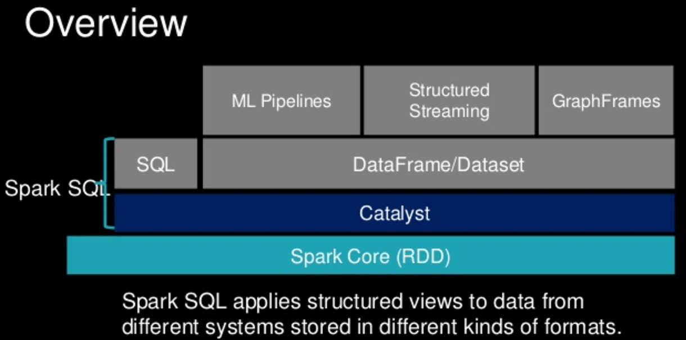

Catalyst优化：优化处理查询语句的整个过程，包括解析、绑定、优化、物理计划等，主要由关系代数（relation algebra）、表达式（expression）以及查询优化（query optimization）组成。

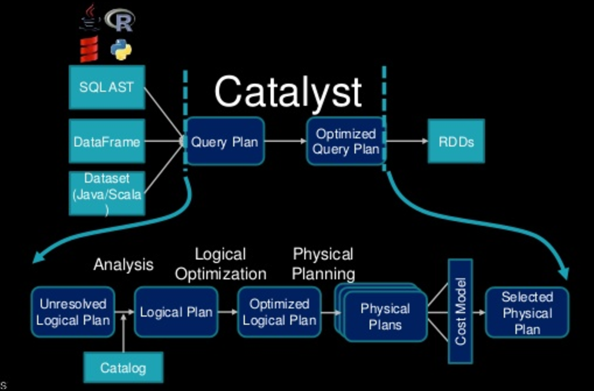

具体的原理，见databricks官方博客的详细描述 [Deep Dive into Spark SQL’s Catalyst Optimizer](https://databricks.com/blog/2015/04/13/deep-dive-into-spark-sqls-catalyst-optimizer.html)

```
Analysis: 解析表的基本信息(字段名、类型），解析UDF。

Logical Plan: 应用各个Rules,如constant folding, predicate pushdown, projection pruning, null propagation, Boolean expression simplification

Physical Plan: 生成多个物理可执行计划，选择其中成本最低的一个；还有join 的优化，见 https://www.slideshare.net/databricks/optimizing-apache-spark-sql-joins

Code Generation: 生成经过scala编译器优化的 Java bytecode

```

参考：[Spark SQL Internals](https://www.slideshare.net/databricks/a-deep-dive-into-spark-sqls-catalyst-optimizer-with-yin-huai)

参考：[Deep Dive into Spark SQL’s Catalyst Optimizer](https://databricks.com/blog/2015/04/13/deep-dive-into-spark-sqls-catalyst-optimizer.html)

Q15: Spark如何支持exactly-once的数据处理？

输入时记录offset, 输出时，确保是幂等或者支持事务。

幂等：输出多次，结果相同，比如生成文件覆盖上次生成的文件。

Q16: 影响 Spark App 性能／并发能力的重要因素有哪些，如何调优?

* Excutor Mem/Core size

* task并行程度

* cache常用的RDD

* 尽量避免shuffle

* GC / Kyro

* HDFS 读写性能(如果是HDFS input)

* 尽量用DataFrame 代替RDD (catalyst优化)

* 实践：避免数据倾斜

* 实践：避免单个executor上的task执行慢，拖慢task所在的stage。

Q17: RDD.cache(), RDD.persist() 有什么不同？

With `cache()`, you use only the default storage level `MEMORY_ONLY`. With `persist()`, you can specify which storage level you want

```
/** Persist this RDD with the default storage level (`MEMORY_ONLY`). */
def persist(): this.type = persist(StorageLevel.MEMORY_ONLY)

/** Persist this RDD with the default storage level (`MEMORY_ONLY`). */
def cache(): this.type = persist()
```

Q18: Spark Streaming 数据接收(Receiver)原理?

* 在StreamingContext启动过程中，ReceiverTracker(Driver端)会把流数据接收器 Receiver分发到Executor上，在每个Executor上，
由ReceiverSupervisor启动对应的Receiver。

* Receiver接收到的数据生成Block, push 到Block队列，并通知BlockManager管理。

* 在处理RDD时，Driver端的BlockManager负责Block元数据的维护，Executor负责读写数据。

keyword: Receiver, Block Manager

Q19: 如何解决Spark任务的数据倾斜？

Q20: Map vs FlatMap ?

```
val textFile = sc.textFile("README.md") // create an RDD of lines of text

// MAP:

textFile.map(_.length)  // map over the lines:

    res2: Array[Int] = Array(14, 0, 71, 0, 0, ...)

          // -> one length per line

// FLATMAP:

textFile.flatMap(_.split(" "))   // split each line into words:

    res3: Array[String] = Array(#, Apache, Spark, ...) 

          // -> multiple words per line, and multiple lines
          // - but we end up with a single output array of words
```

Q21: ReduceByKey vs GroupByKey ?

```
# word count example， 用reduceByKey, groupByKey都能实现。

val words = Array("one", "two", "two", "three", "three", "three")
val wordPairsRDD = sc.parallelize(words).map(word => (word, 1))

# reduceByKey的用法
val wordCountsWithReduce = wordPairsRDD
  .reduceByKey(_ + _)
  .collect()

# groupByKey的用法
val wordCountsWithGroup = wordPairsRDD
  .groupByKey()
  .map(t => (t._1, t._2.sum))
  .collect()
```

word count example， 用`reduceByKey`, `groupByKey`都能实现，但是reduceByKey在大数据集上效率更高，
原因是reduceByKey在shuffle之前会先将同一个executor中相同key的record合并(reduce),因此shuffle写磁盘和网络传输的数据更少。

如下图reduceByKey的实现：


如下图groupByKey的实现：


参考：[Prefer reduceByKey over groupByKey](https://databricks.gitbooks.io/databricks-spark-knowledge-base/content/best_practices/prefer_reducebykey_over_groupbykey.html)

Q22: Spark Tungsten(钨丝计划) ?

https://databricks.com/blog/2015/04/28/project-tungsten-bringing-spark-closer-to-bare-metal.html

https://www.slideshare.net/databricks/2015-0616-spark-summit

https://spark-summit.org/2015/events/deep-dive-into-project-tungsten-bringing-spark-closer-to-bare-metal/

https://spark-summit.org/east-2017/events/spark-sql-another-16x-faster-after-tungsten/

https://community.hortonworks.com/articles/72502/what-is-tungsten-for-apache-spark.html

http://blog.csdn.net/snail_gesture/article/details/50883980

http://blog.csdn.net/sundujing/article/details/51424491

Q23: Spark的Driver与AM(Application Master)的关系? / Spark:Yarn-cluster和Yarn-client区别与联系?

A23: Driver是Spark层面上的东西，AM是Yarn层面上的东西。当spark app以yarn client方式启动时，driver在spark-submit提交服务器上运行，不在yarn上，
AM在yarn上的某个container中，通过yarn app监控界面的attempt node可以看到AM；当spark app以yarn cluster方式启动时，driver运行在AM(Application Master)中(相同yarn container)。

Q24: 在spark streaming中，Kafka 高级 receiver 与 Kafka direct receiver有什么区别？

yarn cluster: 

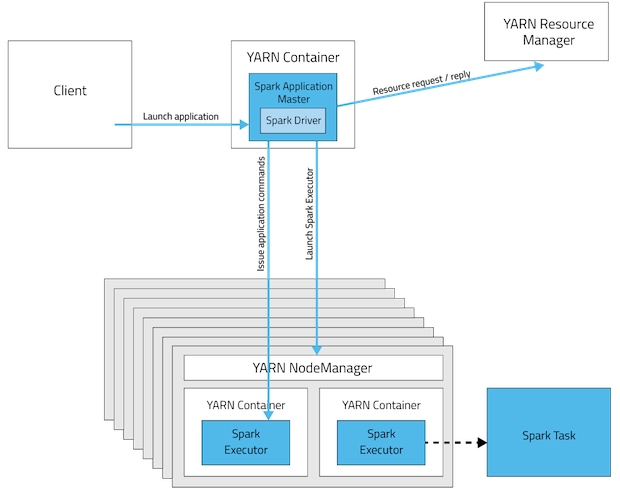

yarn client:

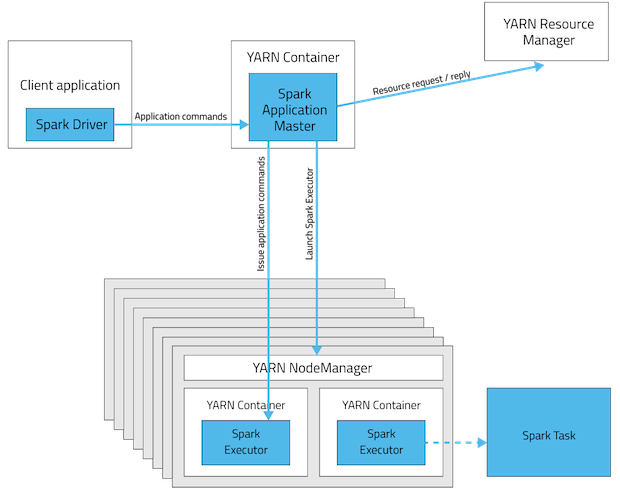

图片来源:[Spark:Yarn-cluster和Yarn-client区别与联系](https://www.iteblog.com/archives/1223.html)

Q25: spark推测执行(speculation)?

A25:

Spark References:

https://spark-summit.org/2014/wp-content/uploads/2014/07/A-Deeper-Understanding-of-Spark-Internals-Aaron-Davidson.pdf

https://databricks.gitbooks.io/databricks-spark-knowledge-base/

《图解Spark 核心技术与案例实战》


#### Spark CommitCoordinator 保证数据一致性

来自： https://cloud.tencent.com/developer/article/1352642

再参考一下 [写文件到HDFS如何保证数据一致性](https://github.com/garyelephant/blog/blob/master/notes/hdfs-yarn.md#16-%E5%86%99%E6%96%87%E4%BB%B6%E5%88%B0hdfs%E5%A6%82%E4%BD%95%E4%BF%9D%E8%AF%81%E6%95%B0%E6%8D%AE%E4%B8%80%E8%87%B4%E6%80%A7)


#### Spark Gracefully Shutdown

---

### Shuffle 原理深入

https://0x0fff.com/spark-architecture-shuffle/

http://datastrophic.io/core-concepts-architecture-and-internals-of-apache-spark/

https://github.com/JerryLead/SparkInternals/blob/master/markdown/4-shuffleDetails.md

http://www.cnblogs.com/jcchoiling/p/6431969.html

http://www.cnblogs.com/jcchoiling/p/6440102.html

https://issues.apache.org/jira/browse/SPARK-2213

http://blog.jobbole.com/103545/

https://www.iteblog.com/archives/1672.html

https://www.iteblog.com/archives/2527.html

https://www.jianshu.com/p/93c2462ed9e4

https://blog.csdn.net/tian_qing_lei/article/details/78002395

https://blog.csdn.net/shuimofengyang/article/details/81534069

https://student-lp.iteye.com/blog/2212442

http://www.cnblogs.com/itboys/p/9226479.html

https://blog.csdn.net/chenjieit619/article/details/53421202

https://blog.csdn.net/qq_21835703/article/details/79104733

https://www.cnblogs.com/itboys/p/9226461.html

https://blog.csdn.net/quitozang/article/details/80904040

https://www.zhihu.com/question/41997909?sort=created

https://www.cnblogs.com/rxingyue/p/7113178.html

---

### Spark SQL 深入

#### 0. Spark SQL 基本原理

https://blog.51cto.com/7741292/2320031

#### 1. 用Spark SQL 做多维分析

主要用到了

```
* group by (普通分组)
* grouping set (union 分组)
* with rollup (上卷)
* with cube (数据立方体)
```

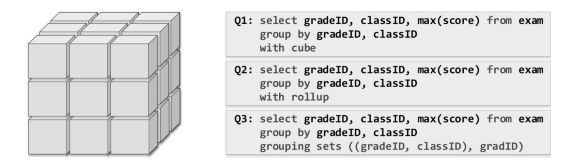

参考：https://blog.csdn.net/u011622631/article/details/84786777

#### 2. Spark SQL 聚合实现原理

能够理解，在Spark SQL中，已下4个SQL是如何实现的：

```
select count(*) from table

select count(distinct c1) from table

select c1, sum(c2) from table group by c1

select c1, sum(c2), count(distinct c3) from table group c1
```

#### 3. Spark SQL Join 的实现原理

* Broadcast Join (将小表广播到大表数据的每个partition所在的节点上)

Broadcast join   条件:

(1) 被广播的表需要小于 `spark.sql.autoBroadcastJoinThreshold` 所配置的值，默认是10M （或者加了broadcast join的hint）

(2) 基表不能被广播，比如 left outer join 时，只能广播右表

疑问：小表的大小是如何判断的？

* ShuffleHash Join (根据grouping key 来对两个表做shuffle, 将相同的key shuffle到同一台机器上)

注意：两个表相同的Key hash到同一个节点后，在这个节点上进行join key时，需要预先将其中一个表在这个节点上的整个分区数据加载到内存中，再用另一个表逐条匹配join key，对大表来说，内存压力是很大的。

疑问: shuffle 的 key 的算法，以及shuffle 目标机器的定位是怎么做的？是否会产生数据倾斜的情况？

* SortMerge Join (???)

仍然需要先将相同的key hash到相同的节点上，接下来对当前节点上的2个表的分区按照join key排序，之后进行类似归并排序的join key操作。这样就不需要将某个表的整个分区加载到内存中了。

疑问：单节点内，分区按照join key排序是如何实现的？如果key特别多，内存放不下呢？

http://www.cnblogs.com/duodushuduokanbao/p/9911256.html

https://blog.csdn.net/wlk_328909605/article/details/82933552

#### 4. Spark SQL Optimization --> CBO(Cost Based Optimization)

一文搞懂spark sql中的CBO（基于代价的优化） https://mp.weixin.qq.com/s/AE4CRMj5jbei3yonGPdDTg

#### 5. Spark SQL Optimization --> RBO(Rule Based Optimization)

理解spark sql 优化策略的最好方法就是自己实现一个 https://mp.weixin.qq.com/s/TzzHGBzFgguujb1qWRVnHA

Spark SQL 内部原理 RBO https://mp.weixin.qq.com/s/Hj4CeyxvHl-crhegEzSEfQ

#### 6. 数据倾斜的处理方案（业务层面解决）：

1. 无关数据过滤(比如过滤掉join关联字段是null的数据)

2. 小表广播：如果 参加 Join 操作 的 两个 表 是 大小 表， 则 可以 采用 BroadcastJoin 的 方式（ 参见 8. 5. 2 小节）， 将 小 表 广播 到 大 表 所在 的 Executor 上， 避免 数据 倾斜 的 出现。 社区 Spark 从 2. 2 版本 之后 支持 在 SQL 中 通过 添加 Hint 的 方式 强制 采用 BroadcastJoin。

3. 倾斜数据分离： 例如 参加 Join 操作 的 两个 表 分别为 t1 和 t2， 有数 据 倾斜 的 表为 t1。 可以 将 t1 的 数据 分为 两部分 t11 和 t12， t11 中 不 包含 数据 倾斜 的 数据， t12 中 只 包含 数据 倾斜 的 数据。 数据表 t11 和 t12 分别 与 t2 进行 Join 操作， 然后 将 结果 合并， 对应 的 SQL 写法 如下。 一方面， t11 与 t2 的 Join 操作 不存在 数据 倾斜 的 问题。 另一方面， 由于 数据表 t12 通常 不会 很大， 所以 t12 与 t2 的 Join 操作 可以 采用 第二 种 方法 执行 BroadcastJoin。 这样 处理 之后， 数据表 t1 与 数据表 t2 的 Join 操作 就能 够 处理 数据 倾斜 的 情况 了。

4. 数据打散： 主要 思想 在于 分散 倾斜 数据， 举 一个 简单 的 例子， 如图 11. 20 所示。 假设 表 A 和 表 B 都有 id、 value 字段， 需 要对 表 A 和 表 B 按照 id 进行 Join 操作， 即“ A. id= B. id”。 此时， 因为 id 都为 a， 所有 的 数据 会在 一个 task 上进 行 关联 操作， 这样 就 出现 了 数据 倾斜。 大 数据 量 的 情况下 这个 task 将 拖 慢 整个 应用 的 执行 效率。 数据 打散 的 处理 方法 就 是将 大 表（ A） 中的 id 加上 后缀(“ id_ 0”-“ id_ 2”)， 起到“打散” 的 作用。 为了 结果 正确， 小 表 B 中的 id 需要 将 每条 数据 都“ 复制” 多 份。 此时 再 执行 join 操作， 将会 产生 3 个 task， 每个 task只需 要 关联 一条 数据， 起到 了 分散 的 作用。 具体 到 SQL 写法， 每个 数据表 的 代码 如下。

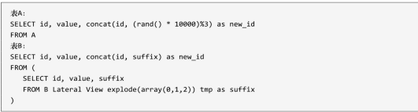

经过 处理 之后， 再 使用 new_ id 作为 聚合 条件。 需要 注意 的 是， 这里 的 rand 函数 的 效果 不一定 非常 均匀， 后缀 数量 可以 根据 实际 业务 的 数据 分 步 来 权衡。 处理 数据 倾斜 时， 有 必要 先用 count( ∗) 查看 数据 的 分 步 情况。 此外， 可以 实现 一个 UDF 函数 用于 专门 生成 0 到 n 的 数组， 便于 添加 后缀。

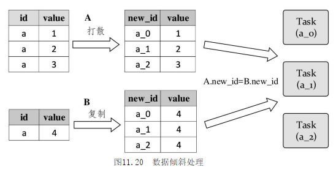

参见：朱锋; 张韶全; 等. Spark SQL内核剖析. 电子工业出版社.

参见：阿里巴巴数据技术及产品部 《大数据之路》的第13章，任务优化：Map 倾斜，Join 倾斜，Reduce倾斜中关于任务的优化。

---

### References

